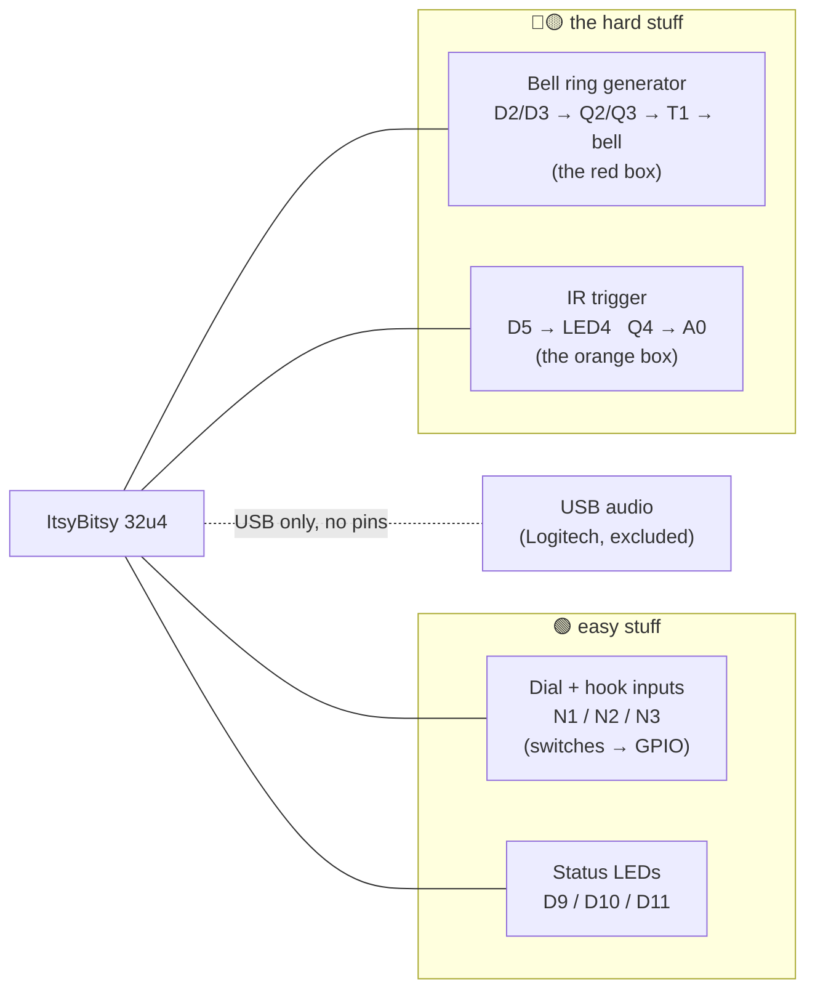
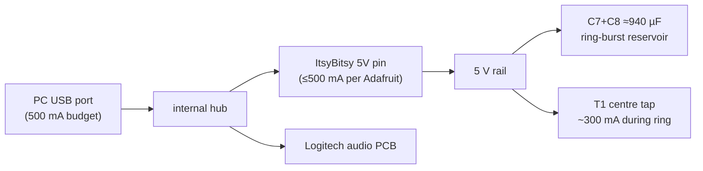

# 01 — The big picture

> **Goal:** hold the whole Rev K schematic in your head as *five independent
> blocks*. Nothing in one block affects another except through the 5 V rail,
> GND, and firmware.

---

## 🧩 The five blocks

**Key insight:** the ItsyBitsy never touches anything above 5 V. All the
danger (±96 V) lives on the *far side* of transformer T1, galvanically
isolated. That is the single most important architectural decision in Rev K.

---

## ⚡ Why each block exists (one line each)

| Block | Job | Why it's shaped this way |
|-------|-----|--------------------------|
| Dial inputs (N1/N2) | Count rotary pulses → digit → volume % | Contacts are just switches to GND; MCU pull-ups make them logic levels |
| Hook input (N3) | Handset lifted? → mute/unmute | Same switch-to-GND pattern |
| LEDs | Human-visible debug | Plain GPIO + 330 Ω |
| **Bell generator** | Ring a ~90 V vintage bell from a 5 V board | 5 V can't ring it; a transformer *makes* the voltage. See [02](02_bell_ring_generator.md) |
| **IR trigger** | "Wave hand → phone rings" | No 38 kHz receiver module on hand → firmware does the ambient-rejection. See [04](04_ir_trigger.md) |

---

## 📖 Background: why the bell is the hard part

The bell is an **electromechanical resonator from the 1950s**. It was designed
to sit across a phone line and ring when the exchange superimposed
**~90 V RMS at 20 Hz** on the line. Three consequences:

1. **It needs voltage, not cleverness.** The coil measures 5.97 kΩ (DC).
   At 5 V: $I = 5/5970 = 0.84\,\text{mA}$. It wants ~15 mA. You cannot
   resistor/capacitor/PWM your way from 0.84 mA to 15 mA — power has to come
   from somewhere. Hence a step-up transformer.
2. **It needs *alternating* polarity.** The ringer is polarized: a permanent
   magnet biases the armature so the clapper swings *between two gongs* only
   if the coil field actually reverses. A unipolar (one-transistor) driver
   would go "thunk" once per burst instead of "briiiing." Hence *push-pull*.
3. **It's resonant near ~20 Hz.** Mechanically (clapper mass + spring). The
   drive frequency has to be close to what it was built for; 20/25/30 Hz were
   all real exchange standards, so 25 Hz is safely inside the band.

Everything unusual in the red box follows from those three facts.

---

## 🧭 Where the power comes from and goes

⚠️ The ring burst (~300 mA for 2 s), the MCU, the LEDs, **and** the Logitech
audio board all share one 500 mA USB budget → this is why the schematic says
"prefer a SELF-POWERED hub." That advice is load-bearing, not decorative.
Details in [03_bell_failure_modes.md](03_bell_failure_modes.md).
