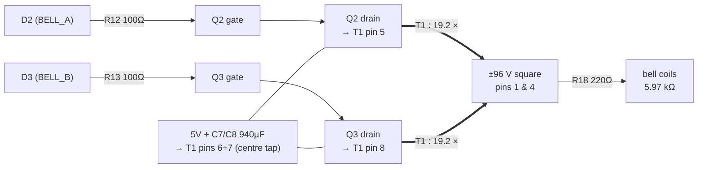

# 02 — The bell ring generator (the red box), piece by piece

> **TL;DR:** two MOSFETs take turns yanking opposite ends of a mains
> transformer's low-voltage winding to ground while its centre sits at 5 V.
> The transformer, run backwards, multiplies that alternation ×19 into a
> ±96 V square wave — which is, deliberately, a synthetic phone line ring
> signal. Every part in the box exists to serve one of three masters:
> **make the voltage**, **reverse the polarity**, or **fail safe**.

---

## 1️⃣ The signal path in one diagram

Firmware alternates D2/D3 every 20 ms (= 25 Hz), never both high,
with a 1 ms both-off deadband at each swap.

---

## 2️⃣ Why a *centre-tapped push-pull*? (the topology decision)

You need **bipolar** drive (the polarized ringer must see field reversal —
see [01_big_picture.md](01_big_picture.md)). Bipolar drive from a single 5 V
supply gives you exactly two textbook options:

| Option | Switch count | High-side drive needed? | Verdict |
|--------|-------------|------------------------|---------|
| H-bridge across the whole winding | 4 | Yes (2 high-side FETs) | Works, more parts |
| **Centre-tapped push-pull** | **2** | **No — both FETs are low-side** | ✅ chosen |

📖 **How the centre tap buys you bipolar drive with only low-side switches:**
the tap sits at +5 V. When Q2 grounds pin 5, current flows *tap → pin 5*
through the top half-winding. When Q3 grounds pin 8, current flows
*tap → pin 8* through the bottom half — which is wound in the **same
direction**, so from the core's point of view the magnetic flux **reverses**.
Two grounded switches, alternating flux. That's the whole trick.

The cost of the trick (nothing is free):

- Each **off** FET sees ~**2×Vin = 10 V** on its drain (its half-winding has
  −5 V induced across it while the other half conducts, and the drain hangs
  off the far end). This is why push-pull FETs are always rated ≥ 2×supply
  plus margin — the 60 V STP55NF06L has ~6× headroom. ✅ (**Rev M:** the part
  on hand is the **IRFZ44N**, 55 V — still ~5× headroom over the ~10.7 V
  clamp, and an RC snubber is now fitted to catch the leakage spike; see
  [03](03_bell_failure_modes.md#-finding-no-snubber).)
- The transformer must be driven **symmetrically** or its core drifts toward
  saturation ("flux walking" — covered in
  [03_bell_failure_modes.md](03_bell_failure_modes.md#-finding-flux-walking)).

---

## 3️⃣ "A mains transformer run backwards" — what that actually means

T1 (Hammond 160G24) was designed for: wall power (115/230 V) in → 24 V C.T.
out. This design feeds power in the **opposite direction**: 5 V pulses into
the 24 V C.T. winding, high voltage out of the 115+115 V windings.

📖 A transformer has no idea which winding you call "primary." It's just
coupled coils; the voltage ratio equals the turns ratio either way. The only
things that care about direction are the ratings (see flux math, §4).

**The ratio arithmetic:**

- LV winding used: **half** of the 24 V C.T. winding = 12 V per half.
- HV winding: the two 115 V primaries wired **in series** = 230 V.
- Turns ratio per half: $n = 230/12 ≈ 19.2$.
- Drive one half with 5 V ⟹ output $≈ 5 × 19.2 ≈ ±96\,\text{V}$ square.

⚠️ **The series-primary decision is the single highest-leverage choice in the
box.** With one 115 V primary alone: $115/12 ≈ 9.6:1 → ±48\,\text{V}$ —
audible but weak (~8 mA). Series: ±96 V, ~15 mA — the original ringing spec.
Same part, same firmware, one extra jumper. (This is also why buying **161**G24
by mistake — single primary — quietly halves the design. The schematic flags
this trap.)

📌 **Phasing trap:** two series-connected windings can be series-*aiding*
(voltages add) or series-*opposing* (they cancel to ≈0 V). The jumper "2–3"
comes from the datasheet's connection diagram and is the aiding orientation —
but verify with a DMM/scope before trusting it, because a wrong guess reads
as "transformer is dead."

**Sanity check that's easy to remember:** the fundamental (25 Hz sine
component) of a ±96 V square wave is $\frac{4}{\pi}·96 ≈ 122\,\text{V peak}
≈ 86\,\text{V RMS}$ — almost exactly the ~90 V RMS a real exchange delivered.
The square drive isn't an approximation of the right signal; its fundamental
**is** the right signal.

---

## 4️⃣ The flux math — why 25 Hz, and why this exact transformer

📖 **The one equation that governs everything here:** a transformer core's
peak flux is set by **volt-seconds per half-cycle**, not by power:

$$B_{pk} \propto \frac{V \cdot t_{half}}{N \cdot A_{core}}$$

Lower frequency = longer half-cycle = more volt-seconds = more flux. Exceed
the core's rated flux and it **saturates**: inductance collapses, the winding
turns into a near-short (just its ~2 Ω of copper), and current spikes.

Compare our square drive to the transformer's design point (12 V RMS sine at
50 Hz, since the 160 series is 50/60 Hz rated):

$$\frac{B_{square}}{B_{rated}} = \frac{V_{sq}/(4 f_d)}{V_{rms}/(4.44 \cdot 50)} = \frac{23.1}{f_d} \quad \text{(for 5 V into a 12 V half)}$$

| Drive freq | Flux vs. rated | Verdict |
|-----------:|---------------:|---------|
| 20 Hz | 1.16× | ⚠️ saturating — buzz, heat, current spikes |
| 23.1 Hz | 1.00× | the exact floor |
| **25 Hz** | **0.93×** | ✅ chosen — 7% margin |
| 30 Hz | 0.77× | safe, but further from bell resonance |

So 25 Hz is not folklore — it's the lowest *real historical ringing
frequency* that keeps this specific core under rated flux with 5 V drive.
The bell doesn't care (20/25/30 Hz were all deployed standards); the core
does.

⚠️ Note this math also explains why you can't grab a transformer with a
*smaller* LV winding for more step-up: a 6.3 V half-winding at 25 Hz would
run at 1.76× rated flux. The 24 V C.T. part is the sweet spot, not a
compromise. (More step-up ideas → more saturation, always, at fixed f.)

---

## 5️⃣ Every passive, and the question it answers

| Part | Value | The question it answers |
|------|-------|------------------------|
| R12/R13 | 100 Ω | "What stops the gate from ringing?" Gate + wiring is an L-C tank; 100 Ω damps it. Also caps the AVR pin's transient charge current (~50 mA for ~150 ns — fine). At 25 Hz, switching loss is irrelevant; anything 47–330 Ω works. |
| R14/R15 | 10 kΩ gate→GND | "What holds the FETs off when the MCU isn't driving?" During reset, the 8-second Caterina bootloader window, and firmware crash, pins float Hi-Z. Without pulldowns a floating gate can drift on/half-on and **cook the transformer with DC**. This is the "fail safe" master. |
| R18 | 220 Ω, ≥0.25 W | "What limits secondary current if something shorts?" Normal dissipation is $I^2R = (15.5\,\text{mA})^2 × 220 ≈ 53\,\text{mW}$, so 0.25 W has 4.7× margin. (Rev K correctly derated this from an over-specced 1 W.) |
| C7/C8 | 2×470 µF = 940 µF at the tap | "Where does the 300 mA burst current come from *instantly*?" USB + hub wiring has inductance/resistance; the caps supply the fast edges and the caps recharge at the average rate. ⚠️ They can **not** carry the whole ring: 300 mA for one 20 ms half-cycle would droop them $\Delta V = It/C = 6.4\,\text{V}$. They're a shock absorber, not a battery — the hub still has to deliver the average. |

📖 **Parallel caps add** (940 µF ≈ 470+470); the caps see only 5 V so a 16 V
rating is generous. The HV side deliberately has **no** capacitor — a cap
there would form a resonant tank with the bell coil and detune everything,
and it would need a >200 V rating.

---

## 6️⃣ The deadband, and where the current goes when both FETs are off

Firmware inserts 1 ms of both-off at every polarity swap. Two reasons:

1. **Shoot-through prevention.** If Q2 and Q3 conducted simultaneously, the
   two half-windings would short the core's flux (their MMFs cancel), leaving
   only copper resistance across each — amps from the 5 V rail for as long
   as the overlap lasts. The deadband makes overlap impossible by
   construction. (Textbook push-pull "dead time.")
2. **It's harmless here.** At 125 kHz PWM a 1 ms deadband would be absurd;
   at 25 Hz it's 5% of a half-cycle. Cheap insurance.

⚠️ **But wait — the winding is inductive. Doesn't interrupting its current
cause a voltage spike?** This is the right adversarial question, and the
answer has two parts:

- **Magnetizing current** (the part that magnetizes the core): when Q2 opens,
  flux continuity transfers the current to the *other* half-winding, which
  drives Q3's drain **below ground** until Q3's **body diode** conducts.
  Energy flows back into the 5 V rail/C7/C8. The off-FET's drain is clamped
  at ~2×5 V + 0.7 V ≈ **10.7 V**. Self-clamping, by topology. ✅
- **Leakage inductance** (the few % of flux that links one half-winding but
  *not* the other): that energy has no coupled path and *does* spike the
  just-opened drain above the 10.7 V clamp. There is **no snubber** in this
  design — the spike is absorbed by the FET's avalanche rating. With
  ~300 mA and a small-transformer leakage of a few mH, the energy is in the
  **µJ range vs. the STP55NF06L's hundreds-of-mJ avalanche rating** — fine,
  but it's an *implicit* dependency. Details:
  [03_bell_failure_modes.md](03_bell_failure_modes.md#-finding-no-snubber).

  > **Rev M update:** an RC snubber *is* now fitted — R16/R17 100 Ω +
  > C9/C10 10 nF, one across each half-winding — because the on-hand IRFZ44N
  > is a 55 V part (under the 60 V rule), so the leakage spike is now clamped
  > rather than left to the avalanche rating. The IRFZ44N is itself
  > avalanche-rated (E_AS 530 mJ, E_AR 9.4 mJ) as a backstop.

---

## 7️⃣ The expected numbers (bench checklist)

| Where | Expect | Why |
|-------|--------|-----|
| Q2/Q3 gate, ringing | 0 ↔ 5 V square, 25 Hz, never both high | direct pin drive |
| Q2/Q3 drain, ringing | ~0 V (on) ↔ ~10 V flat + brief spike (off) | 2×Vin clamp + leakage |
| T1 secondary, unloaded | ~±96 V square (≈190 Vpp) | 19.2 × 5 V |
| T1 secondary, bell attached | sags ~10–20% | winding DCR + R18 vs 5.97 kΩ (see below) |
| 5 V rail draw during burst | ~300 mA avg + start-up spike | 15 mA × 19.2 |
| Bell current | **~13 mA, not the ideal 15.5 mA** | see ⚠️ below |

⚠️ **Why the bell current estimate is optimistic** (two stacked effects):

1. **Copper losses.** The LV half-winding DCR (~2 Ω est.) reflects to the
   secondary as $2 × 19.2^2 ≈ 740\,\Omega$; add HV winding DCR (~150 Ω est.)
   and R18 (220 Ω) → ~1.1 kΩ of series loss vs. the 5.97 kΩ load → **≈16%
   loss**. (Hammond doesn't publish DCR for this series, so these are
   estimates — the uncertainty lands on *loudness*, not function.)
2. **The 5.97 kΩ is DC resistance.** The ringer coil is thousands of turns
   on iron — it has henries of inductance, plus a *motional* impedance from
   the mechanical resonance. At 25 Hz its true impedance is somewhat above
   5.97 kΩ, shaving the current further.

Neither breaks the design; both mean "expect a solid ring, not a
window-rattling one, and judge by ear."
