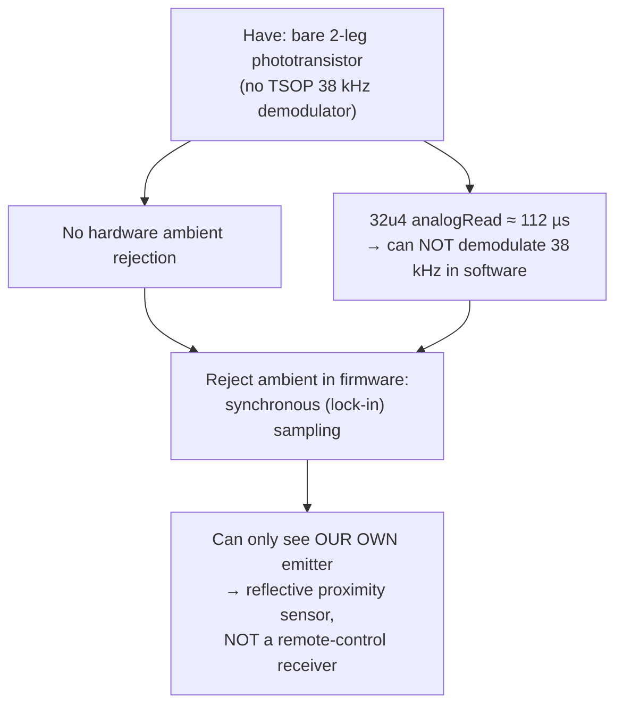

# 04 — The IR trigger (the orange box)

> **TL;DR:** with no 38 kHz receiver module on hand, the design moves the
> entire "ignore the room, see only my own LED" job from silicon into
> firmware: flash the emitter, read the detector *with and without* the
> flash, subtract. The circuit itself is four parts. Almost every risk here
> is a *tuning* risk, not a *topology* risk — and your fluorescent office is
> actually a **favorable** environment (explained below).

---

## 1️⃣ Why it's built this way (the constraint tree)



📖 The subtract-off/on trick is a one-sample **lock-in amplifier** — the same
principle lab instruments use to pull µV signals out of noise: modulate what
you control, correlate against the modulation, everything uncorrelated
averages toward zero. Here the "modulation" is one on/off pair every 25 ms.

The documented limitation is real and worth repeating: this receiver can
**never** see the planned MCU-less remote. That upgrade requires the 3-leg
TSOP38238/VS1838B path (digital input, firmware unaffected elsewhere).

---

## 2️⃣ Circuit tour (all four parts)

**TX:** `D5 → R10 150 Ω → LED4 → GND`.
$I \approx (5 - 1.35\,V_f)/150 ≈ 24\,\text{mA}$ nominal.

- ⚠️ *Nit:* the AVR pin isn't an ideal source — its output impedance
  (~25 Ω at 5 V) drops the real current to ~20 mA. Fine — but it means the
  "~24 mA" label on the schematic is the optimistic bound, and you have
  slightly less optical power than the arithmetic suggests.
- Ratings check: 40 mA absolute max per pin, 20 mA recommended continuous.
  At 20–24 mA with a **1.2% duty cycle** (~0.3 ms lit per 25 ms), thermal
  concerns vanish. ✅ Even calibration (32 back-to-back pairs ≈ 20 ms) is
  brief. ✅

**RX:** `Q4 collector → 5 V; Q4 emitter → A0 node; R11 10 kΩ → GND`.

- A phototransistor is a light-controlled current source:
  $V_{A0} = I_{photo} × 10\,\text{k}\Omega$ (until it saturates near 5 V).
  More IR → higher A0 voltage — non-inverted, which makes the firmware's
  `lit - dark` delta positive and intuitive.
- 📖 Emitter-load vs. collector-load carries the same information (only the
  sign flips); this choice is about readability, not performance.

---

## 3️⃣ The sampling timeline — where the numbers come from

```
     LED off          LED on           LED off
──────┬────────────────┬────────────────┬──────────
      │◄─ 200 µs ─►│ADC│◄─ 200 µs ─►│ADC│
      settle       112µs  settle    112µs
      └──── "dark" ────┘  └──── "lit" ────┘
                    delta = lit − dark
```

- One pair costs ~0.6 ms, taken every 25 ms → main loop blocking is
  negligible; the dial's 38–62 ms pulse edges can't be missed. ✅
- Trigger rule: `delta > irBaseline + IR_TRIGGER_MARGIN(40)` for
  `IR_CONFIRM_SAMPLES(3)` consecutive samples → ring; then 5 s lockout.
- `irBaseline` (boot-measured) captures the built-in emitter→detector
  crosstalk, so the threshold floats above whatever direct leakage the
  physical mounting has. Good — it makes the geometry non-critical.

---

## 4️⃣ ⚠️ FINDING (🟡): 200 µs settle vs. phototransistor speed — marginal

**The physics (corrected from an earlier draft — see the note below):** Q4
is wired as an **emitter-follower** (collector → 5 V, emitter → R11 → GND,
signal taken off the emitter). An emitter-follower's voltage gain is ≈+1,
and the Miller effect only multiplies an internal capacitance when it
bridges an *inverting* stage with gain ≫1 ($C_M = C_{bc}(1-A_v)$). At
$A_v≈1$, $C_M≈0$ — **the Miller effect is suppressed here, not the
mechanism at play.** The real bottleneck is much simpler: the junction
capacitances ($C_{bc}$, $C_{be}$) have to charge/discharge through
whatever's driving them, and the only resistance in that path here is
**R11 itself** — a plain **RC time constant**, no gain multiplier involved.
Datasheet rise/fall figures are typically **~15 µs at R_load = 1 kΩ** — and
scale roughly *linearly with load resistance* (that part of the original
conclusion was right; only the *why* was wrong). At **R11 = 10 kΩ**, expect
**~50–150 µs**, worse at low photocurrents (dim reflections — exactly the
signal you care about).

> 🩹 **Correction note:** an earlier draft of this file attributed the
> slew-rate limit to "the Miller effect," which is backwards for an
> emitter-follower — Miller multiplication requires an *inverting*
> common-emitter/common-source stage (large negative gain), which this
> circuit specifically isn't. Caught during a second-opinion adversarial
> pass (see [gemini_adversarial_review.html](../gemini_adversarial_review.html)
> §5.1); credited there, verified against the standard Miller-theorem
> definition here rather than taken on faith. The numeric guidance (scales
> ~linearly with R11, 50–150 µs at 10 kΩ) was already correct and unchanged.

**The consequence:** with `IR_SETTLE_US = 200`, the "lit" reading may be
taken before the output fully rises. Both baseline and trigger readings are
equally attenuated (same code path — nice property), so this **doesn't
cause false triggers**; it **shrinks the delta**, i.e. eats SNR and range.

**Cheap experiment before tuning `IR_TRIGGER_MARGIN`:** temporarily set
`IR_SETTLE_US` to 1000 and compare the printed deltas at a fixed hand
distance. If delta grows noticeably → the sensor was still slewing; keep
~2–3× the observed settling knee. If unchanged → 200 µs was fine, revert.
(Cost: sample pair grows to ~2.2 ms — still nothing at 25 ms intervals.)

**Alternative knob:** dropping R11 to 2.2–4.7 kΩ speeds the sensor
proportionally, at the cost of delta amplitude (V = I×R). Only worth it if
the settle experiment shows the sensor is badly slew-limited.

---

## 5️⃣ Your environment: fluorescent office — mostly good news

Three separate facts stack in your favor:

1. **Fluorescent lamps are IR-quiet.** Phototransistors peak around
   ~850–950 nm. Fluorescents emit line spectra concentrated in the visible —
   very little near-IR compared to incandescent/halogen/sunlight (the
   classic phototransistor blinder). Your ambient *pedestal* will be small.
2. **The lock-in subtraction handles slow modulation.** Magnetic-ballast
   fixtures modulate at 2× line frequency (100/120 Hz, ~8.3 ms period). The
   dark and lit samples sit only ~312 µs apart, so worst-case ambient drift
   between them is $\sin$-slope-bounded:
   $\epsilon \approx A_{amb} · 2\pi · 120\,\text{Hz} · 312\,\mu\text{s} ≈ 0.24·A_{amb}$.
   With the small fluorescent IR pedestal from (1), $A_{amb}$ is tens of
   counts at most → error well under the margin of 40. And the 3-consecutive
   confirm at 25 ms intervals (which never phase-locks to 120 Hz — 25 ms ≠
   multiple of 8.33 ms) crushes what's left.
3. **Electronic ballasts (most modern offices) run at 20–60 kHz** — the
   ripple period (17–50 µs) is far *shorter* than the 312 µs gap, so it
   shows up as symmetric noise on both samples rather than a systematic
   offset. Random noise on delta → again handled by margin + 3-confirm.

⚠️ The residual risk is **direct line-of-sight from a fixture into Q4**
combined with a dim reflection target. Mitigations, in order of cheapness:
recess Q4 in a tube/shroud pointing where hands will be (also boosts
directivity), keep the schematic's baffle note honored, and only then touch
the firmware constants.

---

## 6️⃣ Remaining findings (all 🟢/tuning-class)

| Finding | Detail | Action |
|---------|--------|--------|
| Boot-time-only calibration | `irBaseline` is measured once at boot. IR LED output drifts ~−1%/°C, dust accumulates, mounting shifts. Indoors this drifts slowly, but a threshold calibrated in January can differ by July. | The `c` recal command exists; consider auto-recal after long idle. **Trap:** never auto-recal while the trigger condition is true (you'd bake a hand into the baseline). |
| `IR_TRIGGER_MARGIN = 40` is a placeholder | 40 counts ≈ 195 mV of delta. Whether that's tight or loose depends entirely on reflectivity/distance — untunable until hardware exists. | Already on the TODO list (tune from live "IR delta" prints). Do the §4 settle experiment *first* so you tune against the real delta. |
| ADC source impedance | The A0 node's Thevenin impedance ≈ 10 kΩ — exactly at the ATmega ADC's recommended max for full accuracy. | ✅ acceptable: back-to-back reads of the *same* channel avoid the mux-settling penalty, which is where >10 k really hurts. |
| A0 float during bootloader | During the 8 s Caterina window, D5 floats low-ish (LED off) and nothing bad is driven. No bell interaction. | ✅ none |

---

## 7️⃣ The upgrade path (already correctly scoped)

When the MCU-less remote happens: TSOP38238 (3-leg, demodulated digital
output) replaces this analog front end for *remote* detection; the
proximity function can keep running in parallel on A0 if desired. The
firmware boundary is clean — `irReadDelta()`/threshold logic swaps for a
digital-edge handler; bell/hook/HID untouched. The design docs already say
this; review concurs. ✅
