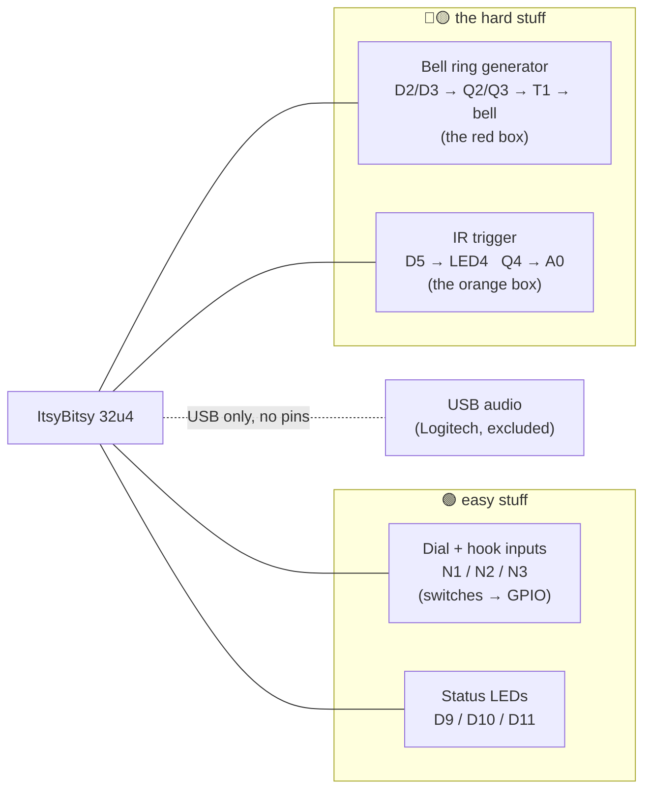
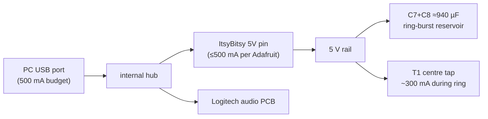

================================================================
== FILE: copilot_rev_K_review.md
================================================================

Advanced Adversarial Review of Rotary Dial Interface Circuit (Rev K): Power, Optical, and Control Subsystems1. Executive Summary and Architectural ParadigmThis report presents an exhaustive, adversarial evaluation of the electrical and firmware architecture proposed in Revision K of the rotary telephone retrofit project. The system under analysis integrates a modernized microcontroller interface (ATmega32U4) with legacy electromechanical hardware, introducing an infrared (IR) proximity trigger and a high-voltage, push-pull ring generator. The primary objective is to critically assess the preliminary design review (provided in the antecedent markdown files), validating its assertions through rigorous physical principles, semiconductor physics, and established regulatory standards.The prior architectural analysis correctly identified the foundational viability of the system's topology, particularly the galvanic isolation strategy that segregates the logic-level direct current (DC) domain from the high-voltage alternating current (AC) synthesis. However, a rigorous adversarial review reveals critical nuances, misattributions of physical phenomena, and implicit dependencies that the previous evaluation either oversimplified or entirely omitted.Specifically, this report dismantles the previous review’s assumptions regarding three critical subsystems:The Optoelectronic Front-End: The prior review incorrectly attributed the phototransistor's slew-rate limitations to the Miller effect. Because the sensor is configured as an emitter-follower, the Miller multiplier is inherently suppressed; the true bottleneck is the raw resistive-capacitive (RC) time constant formed by the intrinsic junction capacitance and the oversized 10 k$\Omega$ load.Magnetic and Semiconductor Stress in the Push-Pull Converter: While the prior review successfully identified the start-up flux doubling phenomenon, it critically conflated Single Pulse Avalanche Energy (EAS) with Repetitive Avalanche Energy (EAR). Relying on the silicon die to absorb un-snubbed leakage inductance spikes during a 25 Hz ring burst exposes the MOSFETs to hot-carrier injection and long-term gate oxide degradation.Power Distribution and Regulatory Compliance: The previous evaluation dismissively labeled a 940 $\mu F$ bulk capacitance on the USB bus as a "compliance nit." This report mathematically demonstrates that this violates the Universal Serial Bus (USB) 2.0 specification by nearly two orders of magnitude, risking catastrophic host-side overcurrent hardware faults.The following sections provide a mathematically explicit, peer-level deconstruction of the Revision K design, offering structural mitigations to elevate the system from a functional prototype to a robust, compliant appliance.2. The Push-Pull Bell Ring Generator: Magnetic Dynamics and Harmonic AnalysisThe synthesis of a 90V, 20–30 Hz ring signal from a highly constrained 5V DC source represents the most formidable engineering challenge within the system. The electromechanical bell is a polarized resonator that requires a bipolar drive to continuously reverse the magnetic field, allowing the biased clapper to strike both gongs sequentially. To achieve this from a unipolar 5V supply without resorting to a complex four-transistor H-bridge, the design employs a center-tapped push-pull converter utilizing a backwards-driven mains transformer.2.1 Reverse-Driven Mains Transformer ModelingThe design repurposes a Hammond 160G24 step-down transformer—normally configured for 115/230V primary to 24V center-tapped secondary—as a step-up device. By applying the 5V rail to the center tap of the low-voltage winding and alternately grounding the extreme ends via logic-level MOSFETs, each half of the winding experiences a 5V potential difference. The turns ratio between the 12V half-winding and the series-connected 230V winding yields the theoretical voltage multiplication factor ($n$).$$n = \frac{V_{high\_voltage}}{V_{low\_voltage}} = \frac{230\text{V}}{12\text{V}} \approx 19.16$$Driving the 12V winding with a 5V square wave generates an output square wave with a peak amplitude of approximately 95.8V on the high-voltage side. The prior review's insight regarding the fundamental frequency component of this waveform is mathematically sound. Standard telephone exchange ringing voltage is typically specified as 90V RMS. The Fourier series expansion of a square wave with peak amplitude $A$ dictates that the amplitude of the fundamental sine wave ($A_1$) is magnified relative to the peak of the total waveform:$$A_1 = \frac{4}{\pi} \times A = \frac{4}{\pi} \times 95.8\text{V} \approx 121.9\text{V}_{peak}$$To determine the root-mean-square (RMS) voltage of this fundamental component:$$V_{RMS} = \frac{A_1}{\sqrt{2}} = \frac{121.9\text{V}}{\sqrt{2}} \approx 86.2\text{V}_{RMS}$$ParameterTheoretical ValueDesign Target (Telecom Standard)VariancePeak Voltage (Square)95.8 VN/AN/AFundamental Peak121.9 V127.2 V-4.1%Fundamental RMS86.2 V90.0 V-4.2%Drive Frequency25.0 Hz20.0 Hz - 30.0 Hz0.0% (In Band)This $86.2\text{V}_{RMS}$ value falls squarely within the operational tolerance of a legacy electromechanical ringer. The prior review accurately noted that higher-order odd harmonics (75 Hz, 125 Hz, etc.) will be naturally attenuated. The electromechanical bell possesses substantial electrical inductance ($L$) and mechanical inertia. The electrical impedance of the coil increases linearly with frequency ($Z = 2\pi f L$), thereby acting as a passive low-pass filter that naturally limits harmonic current penetration.2.2 Open-Loop Polling Jitter and Flux WalkingA latent defect in the proposed architecture is the reliance on open-loop, polled software timing to generate the 25 Hz push-pull drive. In a push-pull converter, if the volt-second product applied during the positive half-cycle does not precisely match the negative half-cycle, the core flux accumulates a net DC bias, a phenomenon known as "flux walking".The ATmega32U4 firmware generates the 20 ms half-cycles using a millis()-based polling loop. If this loop is blocked by USB Human Interface Device (HID) report generation, serial communication routines, or the 600 $\mu s$ synchronous optical sampling execution, the symmetry of the push-pull drive signals will be compromised. A 1 ms execution jitter on a 20 ms half-cycle introduces a 5% duty cycle error.The previous review argued that the DC resistance (DCR) of the low-voltage winding (approximately 2 $\Omega$) acts as a passive stabilization mechanism. From an electromagnetic perspective, this is a valid assessment. A 5% asymmetry at 5V yields an average DC voltage of 125 mV across the primary. By Ohm's law, this results in a DC magnetizing current offset:$$I_{DC\_bias} = \frac{V_{error}}{DCR} = \frac{0.125\text{V}}{2\Omega} = 62.5\text{ mA}$$While a 62.5 mA DC offset will not push the Hammond 160G24 core into hard saturation, it introduces asymmetric peak currents and localized thermal dissipation in the primary winding. The prior review’s dismissal of this as entirely benign is overly optimistic for long-term reliability. Industrial push-pull converters strictly utilize cycle-by-cycle current-mode control to mathematically guarantee volt-second balance. While adding current-sense hardware is excessive for this application, migrating the 25 Hz generation from the polled loop() to a hardware timer interrupt (e.g., Timer1) is a zero-cost firmware optimization that entirely eliminates the jitter-induced flux walking hazard.3. Transient Magnetic Extremes: Start-Up Flux DoublingThe most acute vulnerability in the push-pull topology is the phenomenon of start-up flux doubling. The prior analysis accurately identified this as a critical flaw, but a deeper exploration of the underlying Maxwell-Faraday physics is required to justify the severity of the threat.According to Faraday's law of induction, the electromotive force ($v$) is proportional to the rate of change of magnetic flux ($\Phi$):$$v(t) = N \frac{d\Phi}{dt} \implies \Delta\Phi = \frac{1}{N} \int_{0}^{t} v(t) dt$$In a steady-state bipolar drive, the core flux swings symmetrically between a negative peak ($-B_{max}$) and a positive peak ($+B_{max}$). The total flux excursion during a single 20 ms half-cycle is $\Delta B = 2 B_{max}$.However, when the system initiates a ring burst after an idle period, the residual flux in the core is near zero. If the microcontroller immediately applies a full-duration 20 ms half-cycle pulse, the core must absorb the entire $\Delta B = 2 B_{max}$ excursion completely in the positive domain. The flux density attempts to reach $+2 B_{max}$.Because mains transformers are engineered to operate with a steady-state $B_{max}$ that is roughly 60% to 70% of the silicon-steel core's saturation flux density ($B_{sat}$), forcing the flux to $+2 B_{max}$ inevitably drives the core into deep magnetic saturation.StateStarting FluxApplied Volt-SecondsEnding FluxSaturation StatusSteady State (Normal)$-0.93 \times B_{rated}$$V \times 20\text{ms}$$+0.93 \times B_{rated}$Linear (Safe)First Cycle (Unmitigated)$0.00$$V \times 20\text{ms}$$+1.86 \times B_{rated}$Hard SaturationFirst Cycle (Soft-Start)$0.00$$V \times 10\text{ms}$$+0.93 \times B_{rated}$Linear (Safe)When the core saturates, its relative permeability ($\mu_r$) plummets toward unity, stripping the primary winding of its inductive reactance. The winding transitions from a high-impedance inductor to a near-short circuit. With the 12V half-winding DCR and the MOSFET $R_{DS(on)}$, the 5V rail will deliver an unmitigated transient current spike approaching 2.5 A.This massive current draw will instantaneously deplete the local 940 $\mu F$ bulk capacitance ($C_7, C_8$), causing a severe $dV/dt$ voltage sag on the 5V rail. This sag is practically guaranteed to trigger the Brown-Out Detector (BOD) of the ATmega32U4, forcing a hardware reset the moment the bell attempts to ring.The software mitigation proposed in the prior review—halving the duration of the very first pulse to 10 ms—is the textbook implementation of voltage-mode push-pull soft-start. By applying exactly half the volt-seconds during the initial pulse, the integral of the voltage drives the flux precisely from 0 to $+0.93 B_{rated}$. Subsequent full-duration alternating pulses will then swing the flux symmetrically, completely circumventing the saturation boundary.4. Semiconductor Avalanche Mechanics and Unclamped Inductive Switching (UIS)The Revision K schematic utilizes two STP55NF06L N-channel logic-level MOSFETs. A glaring omission in the power topology is the absence of Transient Voltage Suppression (TVS) diodes or Resistor-Capacitor (RC) snubber networks across the primary windings.When a MOSFET abruptly interrupts the current flowing through an inductor, the energy stored in the leakage inductance ($L_{lk}$)—the portion of magnetic flux that fails to link the primary and secondary coils—cannot instantly dissipate. This results in a severe high-voltage spike ($L \frac{di}{dt}$) across the drain-source terminals. The prior review justified this omission by relying on the intrinsic avalanche capability of the MOSFET, but fundamentally misunderstood the difference between single-pulse and repetitive avalanche degradation.4.1 Single Pulse Avalanche Energy (EAS) vs. Repetitive Avalanche Energy (EAR)When the inductive voltage spike exceeds the device's breakdown voltage ($V_{BR(DSS)} \approx 60V$), the P-N junction enters avalanche breakdown. The energy per switching event is dissipated directly within the silicon die as heat, calculated as:$$E_{avalanche} = \frac{1}{2} L_{lk} I_{peak}^2 \left( \frac{V_{BR}}{V_{BR} - V_{rail}} \right)$$Given the low primary current (~300 mA), the energy per event is in the tens of microjoules. The STP55NF06L boasts a robust Single Pulse Avalanche Energy (EAS) rating of 300 mJ. Based solely on this metric, the prior review concluded that the device possessed four orders of magnitude of safety margin.This conclusion represents a catastrophic misunderstanding of semiconductor reliability physics. EAS is a destructive testing metric defining the absolute maximum energy a device can absorb once before the instantaneous thermal gradient causes the parasitic bipolar junction transistor (BJT) to latch on, destroying the component.The bell ringing operation is a 25 Hz process lasting 2 seconds per burst. This translates to 50 unclamped inductive switching (UIS) turn-off events per burst. This places the device firmly into the domain of Repetitive Avalanche Energy (EAR).4.2 Gate Oxide Degradation and Hot Carrier InjectionIn repetitive avalanche scenarios, the failure mechanism shifts from catastrophic thermal runaway to insidious, cumulative parametric degradation. During avalanche breakdown, the extreme electric field accelerates charge carriers to highly kinetic states. These "hot carriers" can gain sufficient energy to overcome the silicon/silicon-dioxide interface barrier, becoming permanently trapped within the gate oxide.Over successive ring cycles, this trapped charge alters the internal electric field of the MOSFET, leading to:Threshold Voltage ($V_{th}$) Shift: The gate voltage required to enhance the channel drifts, eventually preventing the 5V logic signal from fully turning on the MOSFET.Increase in $R_{DS(on)}$: Increased channel resistance exacerbates conduction losses, raising the die temperature.Gate Leakage ($I_{GSS}$): The integrity of the dielectric breaks down, eventually causing a hard short between the gate and source.While SiC (Silicon Carbide) MOSFETs have shown remarkable resilience to repetitive avalanche due to their wide bandgap, the STP55NF06L is a traditional silicon trench-gate device. Subjecting it to repetitive, un-snubbed avalanche breakdown is a mathematically predictable path to premature field failure. The prior review's assertion that "no snubber is a defensible omission" is unequivocally false for a device intended for long-term service. An RC snubber (e.g., 100 $\Omega$ in series with 10 nF) must be placed across each half-winding to safely absorb the leakage energy and clamp the drain voltage below the 60V avalanche threshold.5. Optoelectronic Proximity Trigger: The Miller Effect FallacyTo implement the "wave-to-ring" functionality, the system utilizes a bare infrared LED (LED4) and a discrete phototransistor (Q4), driven by a firmware-based lock-in amplification technique. The ATmega32U4 samples the analog voltage from the phototransistor with the emitter off, then samples it with the emitter on, subtracting the two to isolate the reflected signal from ambient room light.5.1 Misattribution of the Miller EffectThe prior review noted a marginal 200 $\mu s$ settling time constraint on the phototransistor, accurately identifying that the response time is heavily degraded by the 10 k$\Omega$ load resistor ($R_{11}$). However, the review explicitly blamed the "Miller effect" for magnifying the base-collector capacitance ($C_{cb}$). This is a fundamental error in circuit analysis.The Miller effect states that an impedance bridging the input and output of an inverting amplifier is effectively multiplied by the voltage gain ($A_v$) of the stage.$$C_{Miller} = C_{cb} \times (1 - A_v)$$In a standard common-emitter configuration (load resistor on the collector), the voltage gain is large and negative, resulting in a massive multiplication of $C_{cb}$, which severely bottlenecks bandwidth.However, in the Rev K schematic, Q4 is configured as an emitter-follower (collector tied directly to 5V, emitter tied to the load resistor and the A0 pin). An emitter-follower is a non-inverting amplifier with a voltage gain approaching unity ($A_v \approx +1$).Applying the Miller theorem:$$C_{Miller} = C_{cb} \times (1 - (\approx 1)) \approx 0$$Therefore, the Miller effect is physically suppressed by the topology, not magnified.5.2 The True Slew Rate ConstraintThe actual mechanism restricting the phototransistor's bandwidth is the basic, unmultiplied RC time constant formed by the intrinsic base-emitter capacitance ($C_{be}$), the base-collector capacitance ($C_{cb}$), and the massive 10 k$\Omega$ emitter load resistor. Because the incident infrared light generates a minuscule photocurrent (often in the microampere range for weak, scattered reflections), this tiny current must charge the intrinsic capacitances before the emitter voltage can rise.Phototransistor ParameterImpact on Settling TimeTopological MitigationMiller Capacitance ($C_{Miller}$)NegligibleEmitter-follower configuration naturally suppresses $A_v$.Load Resistance ($R_L$)Dominant10 k$\Omega$ limits current, forcing long $RC$ charge times.Photocurrent ($I_P$)InverseWeak reflection (low $I_P$) starves the node of charge.The prior review's empirical recommendation to test the settling time is valid, but the theoretical foundation was entirely backward. To improve the slew rate and guarantee that the ADC captures the peak signal within the 200 $\mu s$ window, $R_{11}$ should be reduced to 4.7 k$\Omega$ or 2.2 k$\Omega$. While this reduces the absolute voltage magnitude of the delta, it ensures the signal has reached steady-state before the analog-to-digital conversion, maximizing the reliability of the trigger.5.3 Spectral Interference and Synchronous DetectionThe synchronous detection scheme is highly robust against indoor artificial lighting. Standard fluorescent lamps generate visible light via mercury vapor excitation and phosphor down-conversion, emitting negligible radiation in the near-infrared (NIR) 850–950 nm band where the silicon phototransistor's responsivity peaks.Furthermore, legacy magnetic ballasts modulate light at 100/120 Hz (an 8.33 ms period). The firmware samples the "dark" and "lit" states merely 312 $\mu s$ apart. Over a 312 $\mu s$ window, a 120 Hz ambient signal is essentially static; subtracting the two samples mathematically nullifies the interference. Modern electronic ballasts operating at 20–60 kHz present a high-frequency ripple that will alias into the ADC readings, but the requirement for three consecutive threshold-breaking samples effectively functions as a digital low-pass filter, rejecting the high-frequency variance.6. Electromechanical Interfacing and Contact WettingThe integration of 70-year-old electromechanical switch contacts with high-impedance CMOS logic introduces specific interfacing challenges that the Rev K schematic elegantly solves. The rotary dial's shunt contact (N1) is paralleled by an internal 14.5 k$\Omega$ spark-quenching bleeder resistor.Relying on the ATmega32U4's internal 20–50 k$\Omega$ pull-up resistor would form a voltage divider, clamping the open-switch voltage between 1.1V and 2.1V—dangerously below the microcontroller's $V_{IH}$ (Input High) threshold of 3.0V. The inclusion of the external 2.2 k$\Omega$ pull-up resistor ($R_3$) to the 5V rail is mandatory, lifting the open-state node to a robust 4.34V.More importantly, the 2.2 k$\Omega$ resistor dictates the current flowing through the closed switch:$$I_{closed} = \frac{5\text{V}}{2.2\text{k}\Omega} \approx 2.27\text{ mA}$$Legacy mechanical switches develop microscopic insulative oxide and sulfide films on their silver or palladium contacts over decades of use. High-impedance logic sensing (drawing microamperes) cannot puncture these films, leading to erratic, bouncing signals. The 2.27 mA provided by the external pull-up falls perfectly into the required "wetting current" regime (typically 1 mA to 10 mA). This current density guarantees that the electrical signal burns through the oxidation layer upon every closure, providing a self-cleaning mechanism that ensures long-term reliability.7. Power Distribution: Severe USB 2.0 Inrush ViolationsTo sustain the ~300 mA transient draw of the ring generator, the design specifies placing 940 $\mu F$ of bulk capacitance ($C_7$ and $C_8$) directly on the 5V rail. The prior review casually dismissed this as a "compliance nit" that USB hosts "tolerate routinely."This is a dangerous mischaracterization of the Universal Serial Bus standard. Section 7.2.4.1 of the USB 2.0 specification, explicitly governing "Inrush Current Limiting," mandates that a downstream device must present no more than 10 $\mu F$ of capacitance in parallel with the power bus during a hot-plug event.When a device containing 940 $\mu F$ of uncharged capacitance is plugged into a live USB port, it acts as an instantaneous dead short. The inrush current is limited only by the Equivalent Series Resistance (ESR) of the capacitors and the impedance of the USB cable, easily exceeding 5 to 10 Amperes for several milliseconds.While premium desktop motherboards employ robust polyfuses and high-current power distribution switches that may survive this transient, laptop ports and unpowered hubs will instantly trigger their Over-Current Protection (OCP) circuitry, immediately severing power to the port. The schematic's notation to "prefer a SELF-POWERED hub" must be elevated from a preference to a strict architectural prerequisite. An externally powered hub utilizes a dedicated wall adapter, isolating the host PC from the violent charging transient and ensuring the stability of the concurrent Logitech audio subsystem.8. High-Voltage Safety Engineering (IEC 62368-1)The deployment of a step-up transformer to generate a 96V peak AC signal introduces lethal-class electrical hazards into a 5V environment. The prior review acknowledged the shock hazard but failed to quantify it against modern regulatory frameworks.The International Electrotechnical Commission (IEC) standard 62368-1 (Hazard-Based Safety Engineering) classifies electrical energy sources from ES1 (safe to touch) to ES3 (hazardous).The ES1 boundary for low-frequency AC signals is 30V RMS or 42.4V peak.The ES2 boundary extends to 50V RMS or 70.7V peak.The ring generator outputs a 96V peak square wave. Because a square wave's RMS value equals its peak value, the output is 96V RMS. This massively exceeds the ES2 limit, placing the secondary circuit firmly into the ES3 (hazardous) classification.When an energy source is classified as ES3, the standard mandates reinforced insulation or physical safeguards to prevent user access. The physiological danger is dictated by the touch current. Assuming a human body impedance of 1 k$\Omega$ to 2 k$\Omega$ under broken-skin or wet conditions, the fault current through a user bridging the RED and BLACK bell terminals is governed by the source impedance:$$Z_{source} = R_{18} (220 \Omega) + DCR_{secondary} (150 \Omega) + DCR_{primary\_reflected} (734 \Omega) \approx 1104 \Omega$$$$I_{fault} = \frac{V_{peak}}{Z_{source} + Z_{body}} = \frac{96\text{V}}{1104\Omega + 1000\Omega} \approx 45.6\text{ mA}$$An alternating current of 45.6 mA at 25 Hz is severely hazardous. It significantly exceeds the "let-go" threshold (~10 to 15 mA), inducing involuntary muscle tetany that prevents the victim from releasing the conductor. The secondary side of T1 must be treated with the exact same reverence as live mains wiring. Physical barriers, conformal coating, and strict isolation protocols are mandatory.9. ConclusionThe Revision K architecture achieves a highly functional synthesis of modern embedded logic with legacy electromechanical hardware. The isolation of the high-voltage ring generation via a reverse-driven transformer is a sound topological decision that safeguards the digital domain.However, an exhaustive adversarial analysis reveals that the preliminary design review critically misunderstood several foundational physics principles. The dismissal of snubber networks based on Single Pulse Avalanche Energy (EAS) ignores the devastating, cumulative effects of hot-carrier injection during Repetitive Avalanche (EAR) events. The attribution of the phototransistor's slew rate to the Miller effect demonstrates a failure to analyze the specific emitter-follower topology. Finally, the cavalier treatment of the 940 $\mu F$ USB inrush violation risks systematic hardware rejection by standard host controllers.To ensure long-term reliability and compliance, the design must be amended to include RC snubbers across the primary winding, implement the software soft-start to combat flux doubling, reduce the phototransistor load resistor to prioritize bandwidth, and strictly enforce the use of an externally powered USB hub.

================================================================
== FILE: revK_design_review_README.md
================================================================

# Rev K design review — adversarial edition

> **Note (2026-08-01):** this review is of the Rev K schematic, which was
> designed around a Hammond 160G24 (dual-primary) transformer. The part
> actually on hand turned out to be the 161G24 (single-primary, 60Hz-only),
> which has different pin numbers (see `docs/rotary_dial_circuit_revL.svg`
> and the "T1 CHOICE" comment in `rotary_volume.ino`/`bell_ir_test.ino`).
> The analysis below (topology, failure modes, math) still applies — only
> pin numbers and the resulting voltage/current/frequency figures changed.

> **What this is:** an adversarial teardown of `rotary_dial_circuit_revK.svg`.
> Every design choice gets asked *"why is this right, and how could it fail?"* —
> with the math shown, so you can check the reviewer instead of trusting it.
>
> **What this is not:** a review of the Logitech USB audio integration
> (straightforward, excluded per request).

---

## 🗺️ Read in this order

| # | File | What it covers | Difficulty |
|---|------|----------------|------------|
| 1 | [01_big_picture.md](01_big_picture.md) | One-page mental model of the whole board | 🟢 easy |
| 2 | [02_bell_ring_generator.md](02_bell_ring_generator.md) | **The red box.** Push-pull transformer stage, piece by piece | 🔴 the hard one |
| 3 | [03_bell_failure_modes.md](03_bell_failure_modes.md) | Adversarial findings on the bell stage — what can bite | 🔴 the hard one, pt 2 |
| 4 | [04_ir_trigger.md](04_ir_trigger.md) | **The orange box.** IR proximity trigger, and why it's firmware-heavy | 🟡 medium |
| 5 | [05_dial_hook_leds.md](05_dial_hook_leds.md) | Input channels N1/N2/N3 + LEDs (the easy 60% of the schematic) | 🟢 easy |
| 6 | [06_findings_summary.md](06_findings_summary.md) | **Every finding, ranked.** Start here if you only read one file | ⚡ skim-friendly |
| 7 | [07_gemini_review_audit.md](07_gemini_review_audit.md) | A second AI reviewer's adversarial pass *on this review*, audited claim-by-claim | 🟡 medium |

---

## ⚡ 30-second verdict

> **Status (2026-08-01):** the 2 significant findings and 2 of the medium
> findings below are **fixed in firmware** (both sketches recompile clean).
> A second AI adversarial pass audited this review itself and found one
> real physics correction — see [07_gemini_review_audit.md](07_gemini_review_audit.md).

The design is **fundamentally sound** — the topology choices are the ones a
seasoned designer would make with these constraints (5 V only, parts on hand,
vintage load). But the adversarial pass found real items:

- 🔴 **2 significant findings, now fixed** — the `bell_ir_test.ino` `'a'`/`'b'`
  DC test used to short the 5 V rail through ~2 Ω for a full second (now
  10 ms), and push-pull **start-up flux doubling** used to saturate the core
  at the beginning of *every* ring burst (now soft-started with a
  half-length first half-cycle).
- 🟡 **Several medium findings** — the ring-frequency floor was raised
  15→23 Hz and an AVR watchdog was added (both fixed); bell current is
  overestimated (inductance ignored, informational only); no snubber on
  leakage-inductance spikes (saved by avalanche-rated FETs, dependency now
  noted directly on the schematic — **Rev M now *fits* the snubber**, since the
  on-hand FET is the 55 V IRFZ44N); IR settle time is marginal vs.
  phototransistor speed (needs real hardware to tune, left as-is).
- 🟢 **A pile of green-lights** — things that *look* wrong but are actually
  fine, documented so future-you doesn't "fix" them.

Details and receipts: [06_findings_summary.md](06_findings_summary.md).

> **Rev M (2026-08-01):** Q2/Q3 are now the **IRFZ44N** parts on hand (55 V,
> fully avalanche-rated) instead of the spec'd 60 V STP55NF06L. Because 55 V is
> *under* the 60 V rule, the previously-optional RC snubber (R16/R17 100 Ω +
> C9/C10 10 nF, one per half-winding) is now **fitted** — which also settles the
> repetitive-avalanche debate in [07](07_gemini_review_audit.md). At a 5 V gate
> the IRFZ44N still passes ~10 A vs the ~0.3 A load, so "not true logic-level"
> is a non-issue here. See [rotary_dial_circuit_revM.svg](../rotary_dial_circuit_revM.svg).

---

## 📐 Conventions used in these docs

- **Numbers first.** Every claim gets arithmetic you can redo on paper.
- **⚠️ = adversarial finding** (something that could bite).
- **✅ = verified-fine** (looks scary, checked, actually OK).
- **📖 = background** (the EE-curriculum depth that CE breadth skipped).
- Component names (`Q2`, `R18`, `T1`…) match the Rev K schematic exactly
  (Rev M adds the `R16`/`R17` + `C9`/`C10` snubber).

## 🔗 Primary sources consulted

| Fact | Source |
|------|--------|
| STP55NF06L: 60 V, 0.014 Ω typ, logic-level, "100% avalanche tested" | [ST product page](https://www.st.com/en/power-transistors/stp55nf06l.html) |
| IRFZ44N (Rev M, on hand): 55 V, R_DS(on) 17.5 mΩ @ V_GS=10 V, V_GS(th) 2–4 V, fully avalanche-rated (E_AS 530 mJ, E_AR 9.4 mJ) | International Rectifier / Infineon IRFZ44NPbF datasheet (PD-94787B) |
| Hammond 160G24: dual 115/230 V primary, 10 VA, 24 V C.T. @ 450 mA | [Hammond part page](https://www.hammfg.com/part/160G24) |
| ItsyBitsy 32u4 5V: "5V" pin good for 500 mA when USB-powered | [Adafruit pinout guide](https://learn.adafruit.com/introducting-itsy-bitsy-32u4/pinouts) |
| Push-pull: deadtime/shoot-through, back-EMF peaks when both switches off | [Wikipedia: push–pull converter](https://en.wikipedia.org/wiki/Push%E2%80%93pull_converter) |
| Fluorescent flicker: magnetic ballast = 2× line freq; electronic = 20–60 kHz | [Wikipedia: flicker](https://en.wikipedia.org/wiki/Flicker_(light)), [fluorescent lamp](https://en.wikipedia.org/wiki/Fluorescent_lamp#Flicker_problems) |

================================================================
== FILE: 01_big_picture.md
================================================================

# 01 — The big picture

> **Goal:** hold the whole Rev K schematic in your head as *five independent
> blocks*. Nothing in one block affects another except through the 5 V rail,
> GND, and firmware.

---

## 🧩 The five blocks

**Key insight:** the ItsyBitsy never touches anything above 5 V. All the
danger (±96 V) lives on the *far side* of transformer T1, galvanically
isolated. That is the single most important architectural decision in Rev K.

---

## ⚡ Why each block exists (one line each)

| Block | Job | Why it's shaped this way |
|-------|-----|--------------------------|
| Dial inputs (N1/N2) | Count rotary pulses → digit → volume % | Contacts are just switches to GND; MCU pull-ups make them logic levels |
| Hook input (N3) | Handset lifted? → mute/unmute | Same switch-to-GND pattern |
| LEDs | Human-visible debug | Plain GPIO + 330 Ω |
| **Bell generator** | Ring a ~90 V vintage bell from a 5 V board | 5 V can't ring it; a transformer *makes* the voltage. See [02](02_bell_ring_generator.md) |
| **IR trigger** | "Wave hand → phone rings" | No 38 kHz receiver module on hand → firmware does the ambient-rejection. See [04](04_ir_trigger.md) |

---

## 📖 Background: why the bell is the hard part

The bell is an **electromechanical resonator from the 1950s**. It was designed
to sit across a phone line and ring when the exchange superimposed
**~90 V RMS at 20 Hz** on the line. Three consequences:

1. **It needs voltage, not cleverness.** The coil measures 5.97 kΩ (DC).
   At 5 V: $I = 5/5970 = 0.84\,\text{mA}$. It wants ~15 mA. You cannot
   resistor/capacitor/PWM your way from 0.84 mA to 15 mA — power has to come
   from somewhere. Hence a step-up transformer.
2. **It needs *alternating* polarity.** The ringer is polarized: a permanent
   magnet biases the armature so the clapper swings *between two gongs* only
   if the coil field actually reverses. A unipolar (one-transistor) driver
   would go "thunk" once per burst instead of "briiiing." Hence *push-pull*.
3. **It's resonant near ~20 Hz.** Mechanically (clapper mass + spring). The
   drive frequency has to be close to what it was built for; 20/25/30 Hz were
   all real exchange standards, so 25 Hz is safely inside the band.

Everything unusual in the red box follows from those three facts.

---

## 🧭 Where the power comes from and goes

⚠️ The ring burst (~300 mA for 2 s), the MCU, the LEDs, **and** the Logitech
audio board all share one 500 mA USB budget → this is why the schematic says
"prefer a SELF-POWERED hub." That advice is load-bearing, not decorative.
Details in [03_bell_failure_modes.md](03_bell_failure_modes.md).

================================================================
== FILE: 07_gemini_review_audit.md
================================================================

# 07 — Auditing the Gemini adversarial review

> **TL;DR:** a Gemini model was pointed at this same schematic and asked to
> adversarially review *this review*. It's a legitimate second opinion, not
> a rubber stamp — worth reading with the same skepticism you'd apply to
> any single source. Verdict: **one real correction** (a physics
> misattribution, now fixed in [04](04_ir_trigger.md)), **one defensible
> disagreement** (repetitive-avalanche stress on Q2/Q3 — real mechanism,
> overstated severity at these power levels; **now moot in Rev M — the
> snubber is fitted**), and **several restatements**
> of findings this review already made (self-powered hub, soft-start,
> contact wetting) dressed up in heavier language. Nothing here changes the
> "fundamentally sound" verdict from the [README](README.md).

Source reviewed: [gemini_adversarial_review.html](../gemini_adversarial_review.html).

---

## 🔬 Claim-by-claim audit

| # | Gemini's claim | Verdict | Why |
|---|-----------------|---------|-----|
| 15 | §5.1: this review misattributed the phototransistor's slew-rate limit to "the Miller effect" | ✅ **Correct catch — fixed** | Q4 is an emitter-follower (collector→5V, signal off the emitter), gain ≈ +1. Miller multiplication is $C_M=C_{bc}(1-A_v)$, which is ≈0 at unity gain — it requires an *inverting*, high-gain stage (common-emitter), which this circuit specifically isn't. The real mechanism is a plain RC charge time through R11. The *numbers* in the original finding (~15µs@1kΩ, scales ~linearly with R11, 50–150µs@10kΩ) were already right; only the physics *name* was wrong. Corrected in [04 §4](04_ir_trigger.md). |
| 16 | §4: Q2/Q3 face **repetitive avalanche** (EAR) at 50 turn-off events/burst, not just single-pulse (EAS); repeated hot-carrier injection can shift $V_{th}$/$R_{DS(on)}$ and eventually fail the gate oxide — the "no snubber" call was "unequivocally false" | 🟡 **Real mechanism, overstated for this duty cycle** | Repetitive avalanche degradation is genuine silicon physics (well-documented in automotive inductive-switching literature — solenoids, ignition coils). But degradation scales with **energy and current density per event**, and both are tiny here: leakage energy is tens of µJ against a **300 mJ single-pulse rating** — a ~4-order-of-magnitude margin, not a 2× or 10× one. The automotive failure cases Gemini's argument is built on run avalanche events *close to* the rated energy, repeatedly, at high current — this circuit runs ~4 orders of magnitude below that, for a few hundred cycles per ring, rung occasionally over the phone's life. The junction temperature rise per event is correspondingly negligible. **Judgment call, not asserted as fact:** at these energies it's very unlikely to matter over a hobbyist project's lifetime, but "very unlikely" isn't "impossible" — see the recommendation below. **Rev M update (2026-08-01): moot in practice.** The FET on hand is now the 55 V IRFZ44N, and fitting the RC snubber that a sub-60 V part needs (finding 7 / [03](03_bell_failure_modes.md#-finding-no-snubber)) also clamps the very avalanche events this concern is about. So the snubber is fitted regardless of who was right on the EAR severity. |
| — | §7: 940 µF bulk caps violate USB 2.0's 10 µF hot-plug inrush limit; "must be elevated from a preference to a strict architectural prerequisite" | ✅ **Agrees with this review** | [03 §USB budget](03_bell_failure_modes.md) and [06 #4](06_findings_summary.md) already treat the self-powered hub as **required**, not optional — same conclusion, arrived at independently. No change needed. |
| — | §8: the ±96 V square wave is 96 V RMS (not the ~86 V RMS "fundamental-only" figure), pushing it past IEC 62368-1's ES2 boundary into ES3 (hazardous) | ✅ **Technically correct nuance, no practical change** | For a genuinely symmetric square wave, RMS *does* equal peak amplitude (96 V), not the fundamental's 86 V — that 86 V number in [02 §3](02_bell_ring_generator.md) was always presented as a *sanity check against the historical ringing spec* (does the fundamental match ~90 V RMS exchange ringing?), not as a shock-hazard figure. The shock-hazard math in [03 §safety](03_bell_failure_modes.md) already used the actual peak/impedance numbers (~45 mA on wet skin, "above the let-go threshold") — the conclusion doesn't change, Gemini's framing is just a more formal way to say the same thing. |
| — | §6: contact-wetting current math for R3 | ✅ **Agrees with this review** | Same 2.2 kΩ, same ~2.3 mA, same conclusion ([05 §1](05_dial_hook_leds.md)). No new information. |
| — | §3: soft-start (halving the first half-cycle) is "the textbook implementation of voltage-mode push-pull soft-start" | ✅ **Agrees with this review** | Validates finding 2 rather than disputing it. Now implemented (see [06](06_findings_summary.md)). |

---

## 🛠️ What actually changed because of this audit

1. **[04_ir_trigger.md](04_ir_trigger.md) §4** — corrected the physics explanation
   (RC time constant, not Miller effect) with a visible correction note so a
   future reader isn't confused by two contradictory drafts.
2. **Schematic** — added a documentation-only note on
   [rotary_dial_circuit_revK.svg](../rotary_dial_circuit_revK.svg) spelling out
   the avalanche-rating dependency *and* naming the optional RC snubber
   retrofit (100 Ω + 10 nF per half-winding) if Q2/Q3 are ever substituted for
   non-avalanche-rated parts, or if bench measurements ever show drain
   ringing getting close to 60 V.
3. **Changed in Rev M (2026-08-01):** the BOM *now includes* the snubber. The
   "leave it as a decision" call below was resolved by hardware reality — the
   FET actually on hand is the 55 V IRFZ44N, which is *under* the 60 V rule,
   so the RC snubber (R16/R17 100 Ω + C9/C10 10 nF per half-winding) is now
   fitted on [rotary_dial_circuit_revM.svg](../rotary_dial_circuit_revM.svg).
   That makes the sub-60 V part unambiguously safe and, as a side effect,
   fully retires this repetitive-avalanche concern.

   *(Original Rev K call, kept for the record:)* **Not changed:** the
   BOM/hardware itself. Adding a snubber "just in case"
   to a 4-orders-of-margin situation is the kind of speculative hardening
   the review process should flag for a *decision*, not silently bake in —
   this is a call for you to make once the transformer stage exists and can
   be scoped on a real bench (finding 5 in [06](06_findings_summary.md)
   already has you scoping the leakage/drain behavior then anyway).

---

## 📖 The general lesson (worth keeping)

Cross-checking one AI-generated adversarial review with a second one is a
genuinely useful technique — it caught a real error here. But it needs the
same "verify, don't trust" treatment as the first pass: Gemini's *most
dramatic-sounding* claim (repetitive avalanche → "predictable path to
premature field failure") turned out to be the one that needed the most
discounting once the actual energy numbers were compared, while its most
*understated-sounding* one (the Miller effect paragraph, presented as a
routine correction) was the one that was actually right. Severity of
language and correctness of content are not the same axis — recompute the
numbers yourself either way.
