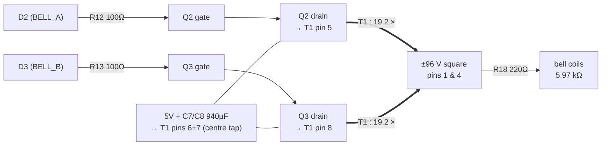
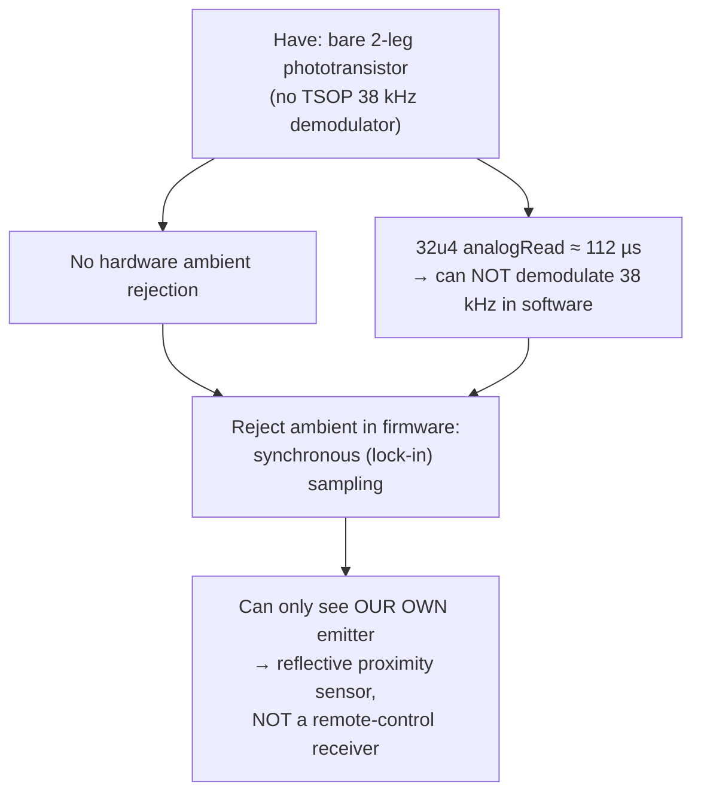

================================================================
== FILE: 02_bell_ring_generator.md
================================================================

# 02 — The bell ring generator (the red box), piece by piece

> **TL;DR:** two MOSFETs take turns yanking opposite ends of a mains
> transformer's low-voltage winding to ground while its centre sits at 5 V.
> The transformer, run backwards, multiplies that alternation ×19 into a
> ±96 V square wave — which is, deliberately, a synthetic phone line ring
> signal. Every part in the box exists to serve one of three masters:
> **make the voltage**, **reverse the polarity**, or **fail safe**.

---

## 1️⃣ The signal path in one diagram



Firmware alternates D2/D3 every 20 ms (= 25 Hz), never both high,
with a 1 ms both-off deadband at each swap.

---

## 2️⃣ Why a *centre-tapped push-pull*? (the topology decision)

You need **bipolar** drive (the polarized ringer must see field reversal —
see [01_big_picture.md](01_big_picture.md)). Bipolar drive from a single 5 V
supply gives you exactly two textbook options:

| Option | Switch count | High-side drive needed? | Verdict |
|--------|-------------|------------------------|---------|
| H-bridge across the whole winding | 4 | Yes (2 high-side FETs) | Works, more parts |
| **Centre-tapped push-pull** | **2** | **No — both FETs are low-side** | ✅ chosen |

📖 **How the centre tap buys you bipolar drive with only low-side switches:**
the tap sits at +5 V. When Q2 grounds pin 5, current flows *tap → pin 5*
through the top half-winding. When Q3 grounds pin 8, current flows
*tap → pin 8* through the bottom half — which is wound in the **same
direction**, so from the core's point of view the magnetic flux **reverses**.
Two grounded switches, alternating flux. That's the whole trick.

The cost of the trick (nothing is free):

- Each **off** FET sees ~**2×Vin = 10 V** on its drain (its half-winding has
  −5 V induced across it while the other half conducts, and the drain hangs
  off the far end). This is why push-pull FETs are always rated ≥ 2×supply
  plus margin — the 60 V STP55NF06L has ~6× headroom. ✅ (**Rev M:** the part
  on hand is the **IRFZ44N**, 55 V — still ~5× headroom over the ~10.7 V
  clamp, and an RC snubber is now fitted to catch the leakage spike; see
  [03](03_bell_failure_modes.md#-finding-no-snubber).)
- The transformer must be driven **symmetrically** or its core drifts toward
  saturation ("flux walking" — covered in
  [03_bell_failure_modes.md](03_bell_failure_modes.md#-finding-flux-walking)).


---

## 3️⃣ "A mains transformer run backwards" — what that actually means

T1 (Hammond 160G24) was designed for: wall power (115/230 V) in → 24 V C.T.
out. This design feeds power in the **opposite direction**: 5 V pulses into
the 24 V C.T. winding, high voltage out of the 115+115 V windings.

📖 A transformer has no idea which winding you call "primary." It's just
coupled coils; the voltage ratio equals the turns ratio either way. The only
things that care about direction are the ratings (see flux math, §4).

**The ratio arithmetic:**

- LV winding used: **half** of the 24 V C.T. winding = 12 V per half.
- HV winding: the two 115 V primaries wired **in series** = 230 V.
- Turns ratio per half: $n = 230/12 ≈ 19.2$.
- Drive one half with 5 V ⟹ output $≈ 5 × 19.2 ≈ ±96\,\text{V}$ square.

⚠️ **The series-primary decision is the single highest-leverage choice in the
box.** With one 115 V primary alone: $115/12 ≈ 9.6:1 → ±48\,\text{V}$ —
audible but weak (~8 mA). Series: ±96 V, ~15 mA — the original ringing spec.
Same part, same firmware, one extra jumper. (This is also why buying **161**G24
by mistake — single primary — quietly halves the design. The schematic flags
this trap.)

📌 **Phasing trap:** two series-connected windings can be series-*aiding*
(voltages add) or series-*opposing* (they cancel to ≈0 V). The jumper "2–3"
comes from the datasheet's connection diagram and is the aiding orientation —
but verify with a DMM/scope before trusting it, because a wrong guess reads
as "transformer is dead."

**Sanity check that's easy to remember:** the fundamental (25 Hz sine
component) of a ±96 V square wave is $\frac{4}{\pi}·96 ≈ 122\,\text{V peak}
≈ 86\,\text{V RMS}$ — almost exactly the ~90 V RMS a real exchange delivered.
The square drive isn't an approximation of the right signal; its fundamental
**is** the right signal.

---

## 4️⃣ The flux math — why 25 Hz, and why this exact transformer

📖 **The one equation that governs everything here:** a transformer core's
peak flux is set by **volt-seconds per half-cycle**, not by power:

$$B_{pk} \propto \frac{V \cdot t_{half}}{N \cdot A_{core}}$$

Lower frequency = longer half-cycle = more volt-seconds = more flux. Exceed
the core's rated flux and it **saturates**: inductance collapses, the winding
turns into a near-short (just its ~2 Ω of copper), and current spikes.

Compare our square drive to the transformer's design point (12 V RMS sine at
50 Hz, since the 160 series is 50/60 Hz rated):

$$\frac{B_{square}}{B_{rated}} = \frac{V_{sq}/(4 f_d)}{V_{rms}/(4.44 \cdot 50)} = \frac{23.1}{f_d} \quad \text{(for 5 V into a 12 V half)}$$

| Drive freq | Flux vs. rated | Verdict |
|-----------:|---------------:|---------|
| 20 Hz | 1.16× | ⚠️ saturating — buzz, heat, current spikes |
| 23.1 Hz | 1.00× | the exact floor |
| **25 Hz** | **0.93×** | ✅ chosen — 7% margin |
| 30 Hz | 0.77× | safe, but further from bell resonance |

So 25 Hz is not folklore — it's the lowest *real historical ringing
frequency* that keeps this specific core under rated flux with 5 V drive.
The bell doesn't care (20/25/30 Hz were all deployed standards); the core
does.

⚠️ Note this math also explains why you can't grab a transformer with a
*smaller* LV winding for more step-up: a 6.3 V half-winding at 25 Hz would
run at 1.76× rated flux. The 24 V C.T. part is the sweet spot, not a
compromise. (More step-up ideas → more saturation, always, at fixed f.)

---

## 5️⃣ Every passive, and the question it answers

| Part | Value | The question it answers |
|------|-------|------------------------|
| R12/R13 | 100 Ω | "What stops the gate from ringing?" Gate + wiring is an L-C tank; 100 Ω damps it. Also caps the AVR pin's transient charge current (~50 mA for ~150 ns — fine). At 25 Hz, switching loss is irrelevant; anything 47–330 Ω works. |
| R14/R15 | 10 kΩ gate→GND | "What holds the FETs off when the MCU isn't driving?" During reset, the 8-second Caterina bootloader window, and firmware crash, pins float Hi-Z. Without pulldowns a floating gate can drift on/half-on and **cook the transformer with DC**. This is the "fail safe" master. |
| R18 | 220 Ω, ≥0.25 W | "What limits secondary current if something shorts?" Normal dissipation is $I^2R = (15.5\,\text{mA})^2 × 220 ≈ 53\,\text{mW}$, so 0.25 W has 4.7× margin. (Rev K correctly derated this from an over-specced 1 W.) |
| C7/C8 | 2×470 µF = 940 µF at the tap | "Where does the 300 mA burst current come from *instantly*?" USB + hub wiring has inductance/resistance; the caps supply the fast edges and the caps recharge at the average rate. ⚠️ They can **not** carry the whole ring: 300 mA for one 20 ms half-cycle would droop them $\Delta V = It/C = 6.4\,\text{V}$. They're a shock absorber, not a battery — the hub still has to deliver the average. |

📖 **Parallel caps add** (940 µF ≈ 470+470); the caps see only 5 V so a 16 V
rating is generous. The HV side deliberately has **no** capacitor — a cap
there would form a resonant tank with the bell coil and detune everything,
and it would need a >200 V rating.

---

## 6️⃣ The deadband, and where the current goes when both FETs are off

Firmware inserts 1 ms of both-off at every polarity swap. Two reasons:

1. **Shoot-through prevention.** If Q2 and Q3 conducted simultaneously, the
   two half-windings would short the core's flux (their MMFs cancel), leaving
   only copper resistance across each — amps from the 5 V rail for as long
   as the overlap lasts. The deadband makes overlap impossible by
   construction. (Textbook push-pull "dead time.")
2. **It's harmless here.** At 125 kHz PWM a 1 ms deadband would be absurd;
   at 25 Hz it's 5% of a half-cycle. Cheap insurance.

⚠️ **But wait — the winding is inductive. Doesn't interrupting its current
cause a voltage spike?** This is the right adversarial question, and the
answer has two parts:

- **Magnetizing current** (the part that magnetizes the core): when Q2 opens,
  flux continuity transfers the current to the *other* half-winding, which
  drives Q3's drain **below ground** until Q3's **body diode** conducts.
  Energy flows back into the 5 V rail/C7/C8. The off-FET's drain is clamped
  at ~2×5 V + 0.7 V ≈ **10.7 V**. Self-clamping, by topology. ✅
- **Leakage inductance** (the few % of flux that links one half-winding but
  *not* the other): that energy has no coupled path and *does* spike the
  just-opened drain above the 10.7 V clamp. There is **no snubber** in this
  design — the spike is absorbed by the FET's avalanche rating. With
  ~300 mA and a small-transformer leakage of a few mH, the energy is in the
  **µJ range vs. the STP55NF06L's hundreds-of-mJ avalanche rating** — fine,
  but it's an *implicit* dependency. Details:
  [03_bell_failure_modes.md](03_bell_failure_modes.md#-finding-no-snubber).

  > **Rev M update:** an RC snubber *is* now fitted — R16/R17 100 Ω +
  > C9/C10 10 nF, one across each half-winding — because the on-hand IRFZ44N
  > is a 55 V part (under the 60 V rule), so the leakage spike is now clamped
  > rather than left to the avalanche rating. The IRFZ44N is itself
  > avalanche-rated (E_AS 530 mJ, E_AR 9.4 mJ) as a backstop.

---

## 7️⃣ The expected numbers (bench checklist)

| Where | Expect | Why |
|-------|--------|-----|
| Q2/Q3 gate, ringing | 0 ↔ 5 V square, 25 Hz, never both high | direct pin drive |
| Q2/Q3 drain, ringing | ~0 V (on) ↔ ~10 V flat + brief spike (off) | 2×Vin clamp + leakage |
| T1 secondary, unloaded | ~±96 V square (≈190 Vpp) | 19.2 × 5 V |
| T1 secondary, bell attached | sags ~10–20% | winding DCR + R18 vs 5.97 kΩ (see below) |
| 5 V rail draw during burst | ~300 mA avg + start-up spike | 15 mA × 19.2 |
| Bell current | **~13 mA, not the ideal 15.5 mA** | see ⚠️ below |

⚠️ **Why the bell current estimate is optimistic** (two stacked effects):

1. **Copper losses.** The LV half-winding DCR (~2 Ω est.) reflects to the
   secondary as $2 × 19.2^2 ≈ 740\,\Omega$; add HV winding DCR (~150 Ω est.)
   and R18 (220 Ω) → ~1.1 kΩ of series loss vs. the 5.97 kΩ load → **≈16%
   loss**. (Hammond doesn't publish DCR for this series, so these are
   estimates — the uncertainty lands on *loudness*, not function.)
2. **The 5.97 kΩ is DC resistance.** The ringer coil is thousands of turns
   on iron — it has henries of inductance, plus a *motional* impedance from
   the mechanical resonance. At 25 Hz its true impedance is somewhat above
   5.97 kΩ, shaving the current further.

Neither breaks the design; both mean "expect a solid ring, not a
window-rattling one, and judge by ear."


================================================================
== FILE: 03_bell_failure_modes.md
================================================================

# 03 — Bell stage: adversarial findings

> **TL;DR:** the topology is right, but the adversarial pass found two
> significant items — one in the *test firmware* ('a'/'b' DC test ≈ shorting
> the 5 V rail through 2 Ω for a second) and one inherent to push-pull
> converters (*start-up flux doubling*: the core saturates briefly at the
> start of **every** ring). Both have cheap firmware fixes. Everything else
> is medium/low.

Severity legend: 🔴 will bite · 🟡 could bite · 🟢 noted, fine

---

## 🔴 FINDING: the `'a'`/`'b'` DC continuity test is a rail short

**Where:** `bell_ir_test.ino`, serial commands `a`/`b` — "drive one gate
HIGH (DC) for **1 s** — half-winding continuity test."

**The problem:** transformers only oppose *changing* current. Apply 5 V DC
to a half-winding and the current ramps as $i(t) = \frac{V}{R}(1 - e^{-t/\tau})$
toward $V/R_{DCR}$ — and the core saturates long before 1 s, collapsing the
inductance. Final current is limited only by copper:

$$I_{DC} \approx \frac{5\,\text{V}}{R_{DCR(half)} + R_{DS(on)}} \approx \frac{5}{2\,\Omega + 0.014\,\Omega} \approx \textbf{2.5 A}$$

for a winding rated **450 mA** and a USB budget of **500 mA** — held for a
**full second**. Expected symptoms: 5 V rail collapse, MCU brownout-reset
(which ironically releases the gate via R14/R15 — accidental crowbar
protection), possible polyfuse trip on the ItsyBitsy or the PC port.

**Why it slipped through:** the mental model "1 s of DC at 5 V is gentle"
is right for *resistive* loads. A transformer winding is a 2 Ω resistor in
disguise once you hold DC on it.

**Fixes (pick one):**
1. **Delete the test.** It's redundant — the documented DMM check
   (R(5-8) ≈ 2× R(5-6)) already proves winding continuity, unpowered. ✅ best
2. Shorten to ≤ 10 ms (current stays on the inductive ramp, well under 1 A).
3. Run it only from a current-limited bench supply, never USB.

---

## 🔴 FINDING: start-up flux doubling — the core saturates at every ring start

**The problem (textbook push-pull behavior):** in steady state the core flux
swings **symmetrically**, −0.93 → +0.93 of rated, each half-cycle
contributing the full swing of volt-seconds. But at the start of a burst the
core is at ≈ zero flux, and firmware applies a **full-length** (19–20 ms)
first half-cycle:

```
steady state:   -0.93 ══════▶ +0.93   (full V·t swing, centered)
first cycle:     0    ══════▶ +1.86   (same V·t — but starting from 0!)
```

1.86× rated flux is **deep saturation** (typical mains cores rate ~1.2–1.5 T
and saturate ~1.7 T). For the last several ms of that first half-cycle the
winding is effectively just its DCR, and current spikes toward the same
~2 A ceiling as the finding above — briefly, from C7/C8.

**Consequences:** a several-ms, amp-class gulp from the bulk caps at every
burst start. 940 µF sourcing 2 A droops at $dV/dt = I/C ≈ 2.1\,\text{V/ms}$,
so even the caps can't hold the rail through it — expect a visible rail sag
and, worst case, MCU brownout **exactly when the phone tries to ring**.
(If the bring-up symptom is ever "board resets when the bell starts," this
is why. It would look maddeningly like a wiring fault.)

**Fix (standard, cheap, firmware-only):** make the **first half-cycle after
any idle/gap period half-length (10 ms)**. Half the volt-seconds → flux ends
the first half-cycle at +0.93 instead of +1.86 → symmetric from the second
half-cycle onward. This is the classic voltage-mode push-pull soft-start.
One `if (firstHalfCycle)` in `bellUpdate()`/`oscillate()`.

*Residual caveat:* core **remanence** from the previous burst is
uncontrolled (burst always restarts on phase A), so even the T/2 trick isn't
mathematically exact — but it bounds the first-cycle flux to ~0.93 + remanence
(≪ 1.86) which is comfortably survivable.

---

## 🟡 FINDING: the `'-'` tuning command allows saturating frequencies

`bell_ir_test.ino` clamps `setRingFreq()` to **15–40 Hz**. From the flux
equation ([02 §4](02_bell_ring_generator.md)),
flux ratio = 23.1/f — so the floor should be **23 Hz**, not 15:

| f | flux vs rated | state |
|---|---|---|
| 15 Hz | 1.54× | 🔴 heavy saturation, amp-class current every half-cycle |
| 20 Hz | 1.16× | 🟡 saturating — buzz + heat |
| 23 Hz | 1.00× | floor |
| 25 Hz | 0.93× | ✅ default |

The header comment even says "raise RING_FREQ_HZ toward 30 if the
transformer buzzes" — right instinct, but the clamp still lets a curious
`-`-press walk into the red zone during exactly the kind of bench session
where you'd try it.

**Fix:** change `if (hz < 15) hz = 15;` → `if (hz < 23) hz = 23;` (or
document 15–22 Hz as "expect buzz + heavy current, short tests only").

---

## 🟡 FINDING: USB power budget only balances with the self-powered hub

Adding it up during a ring burst on a **bus-powered** hub (one 500 mA
allocation for everything):

| Consumer | Est. draw |
|----------|----------:|
| ItsyBitsy (MCU + LEDs) | ~50 mA |
| Logitech audio PCB (idle–active) | ~100–200 mA |
| Ring burst average | ~300 mA |
| Start-up flux spike (above) | amps, ms-scale |
| **Total during ring** | **~450–550 mA + spikes** |

Over budget at the worst moment. The schematic's "prefer a SELF-POWERED hub"
note is **the** load-bearing mitigation — with it, each port gets its own
500 mA and the analysis closes with margin. Without it, you're betting on
the PC port's generosity.

📖 Also worth knowing: **USB 2.0 allows only 10 µF** of downstream
capacitance at hot-plug without inrush limiting; C7/C8 = 940 µF violates
that on paper (charging inrush at connect). In practice hosts tolerate it
routinely — filed as a compliance nit, not a risk. A self-powered hub also
makes this moot.

---

## 🟡 FINDING: <a name="-finding-no-snubber"></a>no snubber — leakage spikes ride on the FETs' avalanche rating

At every turn-off, the energy in the *leakage* inductance (the flux linking
one half-winding but not the other) has nowhere coupled to go and rings the
drain above the 10.7 V clamp ([02 §6](02_bell_ring_generator.md)).

- Energy per event: $\tfrac{1}{2} L_{lk} I^2 ≈ \tfrac{1}{2}(few\,\text{mH})(0.3\,\text{A})^2$ ≈ **tens of µJ**
- STP55NF06L single-pulse avalanche rating: **hundreds of mJ** (ST: "100%
  avalanche tested") → ~4 orders of magnitude of margin ✅

So no snubber is a *defensible* omission — **but it's an undocumented
dependency**: substitute a non-avalanche-rated or lower-voltage FET later
(the IRFZ44N on hand is 55 V — see the Rev M note below) and the margin
quietly shrinks. If a scope ever shows drain spikes flirting with 60 V, an
RC snubber (~100 Ω + 10 nF across each half-winding) is the textbook retrofit.

**Action:** ✅ **Done (Rev M, 2026-08-01).** The FET actually on hand is the
IRFZ44N (55 V) — a *lower-voltage* part than the 60 V rule wants, which is
exactly the "margin quietly shrinks" case above. Rather than lean on the
avalanche rating of a sub-60 V part, the RC snubber (R16/R17 100 Ω +
C9/C10 10 nF, one across each half-winding, each Q drain → 5 V tap) is now
**fitted** on [rotary_dial_circuit_revM.svg](../rotary_dial_circuit_revM.svg).
The IRFZ44N is itself fully avalanche-rated (E_AS 530 mJ, E_AR 9.4 mJ
repetitive) as a backstop, so the snubbed 55 V part has ample margin — and
fitting the snubber also retires the repetitive-avalanche concern from
[07](07_gemini_review_audit.md).

---

## 🟢 FINDING: <a name="-finding-flux-walking"></a>flux walking (push-pull DC imbalance) — real, but self-limiting here

**The classic push-pull disease:** if the two half-cycles don't apply
*exactly* equal volt-seconds (timing jitter, RDS(on) mismatch), the flux
swing drifts off-center each cycle — "staircase saturation." Industrial
designs fix it with current-mode control.

**Here:** `millis()`-based timing on AVR has ~1 ms granularity, so up to
~1 ms asymmetry per 40 ms period → average DC voltage across the winding
≈ $5 × \tfrac{1}{40} = 125\,\text{mV}$. The winding's own DCR (~2 Ω) turns
that into a bounded ~60 mA DC magnetizing offset rather than a runaway —
copper resistance is the (lossy but effective) stabilizer in low-power
push-pull. Slightly asymmetric current spikes on one phase; not a failure.

**Action:** none. If a scope shows one drain's current spike much fatter
than the other's, this is what you're seeing.

---

## 🟢 FINDING: fault matrix — what happens when things go wrong downstream

| Fault | What happens | Protected by |
|-------|--------------|--------------|
| Bell unplugged mid-ring | Secondary unloaded; drains still clamped ~10.7 V; secondary rises to full ±96 V | topology (body-diode clamp); insulation |
| Secondary shorted (pinched wire) | Reflected to LV side ≈ 1 Ω → ~1.7 A rail drag during bursts | nothing but the polyfuse/brownout 🟡 |
| MCU crash with one gate HIGH | DC through half-winding → the 🔴 DC-test scenario | *only* the watchdog you haven't added; R14/R15 handle reset/Hi-Z but **not** a firmware hang with the pin latched high 🟡 |
| Both gates HIGH (firmware bug) | MMFs cancel → 2 windings × ~2 Ω across the rail → ~5 A | deadband-by-construction in `oscillate()` — single code path sets pins, easy to audit ✅ |

**Cheap hardening (optional):** enable the AVR watchdog (`wdt_enable(WDTO_250MS)`)
so a hang can't leave a gate latched. That converts the worst residual row
into a 250 ms blip.

---

## 🟢 SAFETY: quantifying "±96 V bites"

The schematic's warning is correct; here's the arithmetic behind it. Touch
the live secondary and the source impedance is R18 (220 Ω) + HV winding DCR
(~150 Ω) + reflected LV copper (~740 Ω) ≈ **1.1 kΩ**:

- Dry skin (10–100 kΩ): ~1–9 mA → bite/tingle, like a real phone line.
- Wet skin (~1 kΩ): peaks toward ~45 mA — **above the let-go threshold**.

It's isolated from mains and USB, energy-limited, and burst-limited (2 s) —
genuinely non-lethal-class — but "limited by R18" understates it: R18 is
only 20% of the limiting impedance. Insulate the whole HV side, never probe
while ringing, and treat RED/BLACK with phone-line respect. The schematic
already says this; now you know *why* it's exactly right.


================================================================
== FILE: 04_ir_trigger.md
================================================================

# 04 — The IR trigger (the orange box)

> **TL;DR:** with no 38 kHz receiver module on hand, the design moves the
> entire "ignore the room, see only my own LED" job from silicon into
> firmware: flash the emitter, read the detector *with and without* the
> flash, subtract. The circuit itself is four parts. Almost every risk here
> is a *tuning* risk, not a *topology* risk — and your fluorescent office is
> actually a **favorable** environment (explained below).

---

## 1️⃣ Why it's built this way (the constraint tree)



📖 The subtract-off/on trick is a one-sample **lock-in amplifier** — the same
principle lab instruments use to pull µV signals out of noise: modulate what
you control, correlate against the modulation, everything uncorrelated
averages toward zero. Here the "modulation" is one on/off pair every 25 ms.

The documented limitation is real and worth repeating: this receiver can
**never** see the planned MCU-less remote. That upgrade requires the 3-leg
TSOP38238/VS1838B path (digital input, firmware unaffected elsewhere).

---

## 2️⃣ Circuit tour (all four parts)

**TX:** `D5 → R10 150 Ω → LED4 → GND`.
$I \approx (5 - 1.35\,V_f)/150 ≈ 24\,\text{mA}$ nominal.

- ⚠️ *Nit:* the AVR pin isn't an ideal source — its output impedance
  (~25 Ω at 5 V) drops the real current to ~20 mA. Fine — but it means the
  "~24 mA" label on the schematic is the optimistic bound, and you have
  slightly less optical power than the arithmetic suggests.
- Ratings check: 40 mA absolute max per pin, 20 mA recommended continuous.
  At 20–24 mA with a **1.2% duty cycle** (~0.3 ms lit per 25 ms), thermal
  concerns vanish. ✅ Even calibration (32 back-to-back pairs ≈ 20 ms) is
  brief. ✅

**RX:** `Q4 collector → 5 V; Q4 emitter → A0 node; R11 10 kΩ → GND`.

- A phototransistor is a light-controlled current source:
  $V_{A0} = I_{photo} × 10\,\text{k}\Omega$ (until it saturates near 5 V).
  More IR → higher A0 voltage — non-inverted, which makes the firmware's
  `lit - dark` delta positive and intuitive.
- 📖 Emitter-load vs. collector-load carries the same information (only the
  sign flips); this choice is about readability, not performance.

---

## 3️⃣ The sampling timeline — where the numbers come from

```
     LED off          LED on           LED off
──────┬────────────────┬────────────────┬──────────
      │◄─ 200 µs ─►│ADC│◄─ 200 µs ─►│ADC│
      settle       112µs  settle    112µs
      └──── "dark" ────┘  └──── "lit" ────┘
                    delta = lit − dark
```

- One pair costs ~0.6 ms, taken every 25 ms → main loop blocking is
  negligible; the dial's 38–62 ms pulse edges can't be missed. ✅
- Trigger rule: `delta > irBaseline + IR_TRIGGER_MARGIN(40)` for
  `IR_CONFIRM_SAMPLES(3)` consecutive samples → ring; then 5 s lockout.
- `irBaseline` (boot-measured) captures the built-in emitter→detector
  crosstalk, so the threshold floats above whatever direct leakage the
  physical mounting has. Good — it makes the geometry non-critical.

---

## 4️⃣ ⚠️ FINDING (🟡): 200 µs settle vs. phototransistor speed — marginal

**The physics (corrected from an earlier draft — see the note below):** Q4
is wired as an **emitter-follower** (collector → 5 V, emitter → R11 → GND,
signal taken off the emitter). An emitter-follower's voltage gain is ≈+1,
and the Miller effect only multiplies an internal capacitance when it
bridges an *inverting* stage with gain ≫1 ($C_M = C_{bc}(1-A_v)$). At
$A_v≈1$, $C_M≈0$ — **the Miller effect is suppressed here, not the
mechanism at play.** The real bottleneck is much simpler: the junction
capacitances ($C_{bc}$, $C_{be}$) have to charge/discharge through
whatever's driving them, and the only resistance in that path here is
**R11 itself** — a plain **RC time constant**, no gain multiplier involved.
Datasheet rise/fall figures are typically **~15 µs at R_load = 1 kΩ** — and
scale roughly *linearly with load resistance* (that part of the original
conclusion was right; only the *why* was wrong). At **R11 = 10 kΩ**, expect
**~50–150 µs**, worse at low photocurrents (dim reflections — exactly the
signal you care about).

> 🩹 **Correction note:** an earlier draft of this file attributed the
> slew-rate limit to "the Miller effect," which is backwards for an
> emitter-follower — Miller multiplication requires an *inverting*
> common-emitter/common-source stage (large negative gain), which this
> circuit specifically isn't. Caught during a second-opinion adversarial
> pass (see [gemini_adversarial_review.html](../gemini_adversarial_review.html)
> §5.1); credited there, verified against the standard Miller-theorem
> definition here rather than taken on faith. The numeric guidance (scales
> ~linearly with R11, 50–150 µs at 10 kΩ) was already correct and unchanged.

**The consequence:** with `IR_SETTLE_US = 200`, the "lit" reading may be
taken before the output fully rises. Both baseline and trigger readings are
equally attenuated (same code path — nice property), so this **doesn't
cause false triggers**; it **shrinks the delta**, i.e. eats SNR and range.

**Cheap experiment before tuning `IR_TRIGGER_MARGIN`:** temporarily set
`IR_SETTLE_US` to 1000 and compare the printed deltas at a fixed hand
distance. If delta grows noticeably → the sensor was still slewing; keep
~2–3× the observed settling knee. If unchanged → 200 µs was fine, revert.
(Cost: sample pair grows to ~2.2 ms — still nothing at 25 ms intervals.)

**Alternative knob:** dropping R11 to 2.2–4.7 kΩ speeds the sensor
proportionally, at the cost of delta amplitude (V = I×R). Only worth it if
the settle experiment shows the sensor is badly slew-limited.

---

## 5️⃣ Your environment: fluorescent office — mostly good news

Three separate facts stack in your favor:

1. **Fluorescent lamps are IR-quiet.** Phototransistors peak around
   ~850–950 nm. Fluorescents emit line spectra concentrated in the visible —
   very little near-IR compared to incandescent/halogen/sunlight (the
   classic phototransistor blinder). Your ambient *pedestal* will be small.
2. **The lock-in subtraction handles slow modulation.** Magnetic-ballast
   fixtures modulate at 2× line frequency (100/120 Hz, ~8.3 ms period). The
   dark and lit samples sit only ~312 µs apart, so worst-case ambient drift
   between them is $\sin$-slope-bounded:
   $\epsilon \approx A_{amb} · 2\pi · 120\,\text{Hz} · 312\,\mu\text{s} ≈ 0.24·A_{amb}$.
   With the small fluorescent IR pedestal from (1), $A_{amb}$ is tens of
   counts at most → error well under the margin of 40. And the 3-consecutive
   confirm at 25 ms intervals (which never phase-locks to 120 Hz — 25 ms ≠
   multiple of 8.33 ms) crushes what's left.
3. **Electronic ballasts (most modern offices) run at 20–60 kHz** — the
   ripple period (17–50 µs) is far *shorter* than the 312 µs gap, so it
   shows up as symmetric noise on both samples rather than a systematic
   offset. Random noise on delta → again handled by margin + 3-confirm.

⚠️ The residual risk is **direct line-of-sight from a fixture into Q4**
combined with a dim reflection target. Mitigations, in order of cheapness:
recess Q4 in a tube/shroud pointing where hands will be (also boosts
directivity), keep the schematic's baffle note honored, and only then touch
the firmware constants.

---

## 6️⃣ Remaining findings (all 🟢/tuning-class)

| Finding | Detail | Action |
|---------|--------|--------|
| Boot-time-only calibration | `irBaseline` is measured once at boot. IR LED output drifts ~−1%/°C, dust accumulates, mounting shifts. Indoors this drifts slowly, but a threshold calibrated in January can differ by July. | The `c` recal command exists; consider auto-recal after long idle. **Trap:** never auto-recal while the trigger condition is true (you'd bake a hand into the baseline). |
| `IR_TRIGGER_MARGIN = 40` is a placeholder | 40 counts ≈ 195 mV of delta. Whether that's tight or loose depends entirely on reflectivity/distance — untunable until hardware exists. | Already on the TODO list (tune from live "IR delta" prints). Do the §4 settle experiment *first* so you tune against the real delta. |
| ADC source impedance | The A0 node's Thevenin impedance ≈ 10 kΩ — exactly at the ATmega ADC's recommended max for full accuracy. | ✅ acceptable: back-to-back reads of the *same* channel avoid the mux-settling penalty, which is where >10 k really hurts. |
| A0 float during bootloader | During the 8 s Caterina window, D5 floats low-ish (LED off) and nothing bad is driven. No bell interaction. | ✅ none |

---

## 7️⃣ The upgrade path (already correctly scoped)

When the MCU-less remote happens: TSOP38238 (3-leg, demodulated digital
output) replaces this analog front end for *remote* detection; the
proximity function can keep running in parallel on A0 if desired. The
firmware boundary is clean — `irReadDelta()`/threshold logic swaps for a
digital-edge handler; bell/hook/HID untouched. The design docs already say
this; review concurs. ✅


================================================================
== FILE: 05_dial_hook_leds.md
================================================================

# 05 — Dial, hook, and LEDs (the easy 60%)

> **TL;DR:** three switches to ground, three LEDs, one non-obvious resistor.
> Everything here has been validated on hardware already (dial path
> end-to-end, 2026-07-29). Included for completeness and because R3's story
> is the best small lesson in the whole schematic.

---

## 1️⃣ N1 (WHITE / shunt) — the one channel that needed an external part

**The gotcha:** the dial's shunt contact isn't a clean switch. It has a
**14.5 kΩ bleeder resistor permanently wired across the contacts**
(spark-quench, a telephone-era arc suppression trick). So even with the
contact *open*, the GPIO node is tied to GND through 14.5 kΩ.

**Why the internal pull-up loses:** the ATmega's internal pull-up is
20–50 kΩ. That forms a divider with the bleeder:

$$V_{node} = 5 · \frac{14.5k}{14.5k + R_{pu}} = \begin{cases} 2.1\,\text{V} & R_{pu}=20k \quad 🔴 \\ 1.1\,\text{V} & R_{pu}=50k \quad 🔴 \end{cases}$$

Both below the 32u4's $V_{IH} ≈ 0.6·V_{cc} = 3.0\,\text{V}$ → pin reads a
solid, permanent LOW. **This is not a marginal failure — it's deterministic.**

**Why R3 = 2.2 kΩ wins:**

$$V_{node} = 5 · \frac{14.5k}{14.5k + 2.2k} = 4.34\,\text{V} \; ✅ \quad (\gg 3.0\,\text{V})$$

Closed-contact current: $5/2.2k = 2.3\,\text{mA}$ — trivially safe, and 📖
actually *beneficial*: aged contacts want ~1–10 mA of **wetting current** to
punch through oxide films. A high-impedance sense (µA) on 70-year-old
contacts can read intermittently open even when closed; 2.3 mA is in the
sweet spot by accident. ✅

⚠️ *Bring-up memory:* the "dead dial" of 2026-07-29 was R3's rail end not
actually reaching 5 V. Diagnostic signature worth keeping: **solid LOW even
with internal pull-up enabled = external pull-up rail side is dead** (only
the 14.5 kΩ bleeder can win against the internal pull-up). "Hi-Z LOW but
internal-pullup HIGH" = pin genuinely disconnected. Two reads, no DMM.

---

## 2️⃣ N2 (BLUE / pulse) and N3 (GREEN-WHITE / hook) — true dry contacts

Both are clean switches to GND (DMM: ≈0 Ω closed, open otherwise), so the
internal 20–50 kΩ pull-up is sufficient — no divider to fight. ✅
Empirically proven by the working dial path.

**C6 (100 nF, D7 node → GND):** EMI keep-out for the long handset cord
acting as an antenna. Adversarial check on the side effect: rising edges now
charge through the internal pull-up, $\tau = R_{pu}·C = 2\text{–}5\,\text{ms}$
→ the release edge is slow. The 30 ms hook debounce eats that with 6–15×
margin. ✅ Closing the contact discharges C6 through ≈0 Ω — a brief spark of
contact current that, per §1, old contacts actively enjoy. ✅

⚠️ **Known open hardware item (not a design flaw):** as of the 2026-07-29
session, D7 never registered *external* closures even though its silicon pad
self-tests healthy (drive-LOW readback OK, internal pull-up OK). The on-die
self-test cannot clear the **header solder joint** between pad and pin —
that joint is the prime suspect. Design review has nothing to add; this is a
soldering-iron item.

---

## 3️⃣ LEDs (D9/D10/D11 → 330 Ω → LED → GND)

$I = (5 - V_f)/330 ≈ (5-2)/330 ≈ 9\,\text{mA}$ per LED — inside the 20 mA
per-pin recommendation, and all three lit simultaneously (~27 mA total) is
nowhere near the AVR's per-port or package limits. ✅ Nothing adversarial
survives contact with this subcircuit.

---

## 4️⃣ Polled (not interrupt) firmware — reviewed as a design choice

The inputs change at ~10 Hz with 38–62 ms edges (measured,
`dial_test_log.txt`); a ~1 ms poll loop oversamples the fastest edge ~38×.
Interrupts would add ISR/`volatile`/race complexity in 2.5 KB of RAM for
zero functional gain. ✅ Right call — *with one caveat now that Rev J/K
exists:* the poll loop's other new duty is the bell half-cycle timing, and
anything that blocks the loop (HID send, serial prints, the 0.6 ms IR pair)
adds jitter to the 20 ms half-cycles. Bounded, self-correcting via winding
DCR, analyzed in [03 §flux-walking](03_bell_failure_modes.md#-finding-flux-walking)
— fine, but it's why the firmware runs `bellUpdate()` before the 1 ms poll
gate, and that ordering should be treated as load-bearing.


================================================================
== FILE: 06_findings_summary.md
================================================================

# 06 — All findings, ranked

> One row per finding. 🔴 = fix before/at first power-up · 🟡 = fix or
> consciously accept · 🟢 = documented, no action needed.

> **Status update (2026-08-01):** findings **1, 2, 3, 6** are now fixed in
> firmware ([rotary_volume.ino](../../firmware/rotary_volume/rotary_volume.ino),
> [bell_ir_test.ino](../../firmware/bell_ir_test/bell_ir_test.ino)); both
> sketches recompiled clean. The schematic gained a documentation-only note
> for finding 7 (avalanche/no-snubber dependency). See
> [07_gemini_review_audit.md](07_gemini_review_audit.md) for a second-opinion
> adversarial pass that checked this review's own claims and caught one real
> physics error (§5 below / finding 15).

> **Rev M update (2026-08-01):** finding 7 is now *resolved*, not just
> documented — the FET on hand is the 55 V IRFZ44N, so an RC snubber
> (R16/R17 100 Ω + C9/C10 10 nF per half-winding) is **fitted** on
> [rotary_dial_circuit_revM.svg](../rotary_dial_circuit_revM.svg). This also
> retires the repetitive-avalanche concern (finding 15).

---

## 🔴 Significant (2) — ✅ both fixed 2026-08-01

| # | Finding | Where | One-line fix | Status | Detail |
|---|---------|-------|--------------|--------|--------|
| 1 | `'a'`/`'b'` DC test holds 5 V across ~2 Ω of winding DCR for **1 s** → ~2.5 A rail short, brownout/polyfuse trip | `bell_ir_test.ino` | Delete the test (the DMM check already covers it) or cap at 10 ms | ✅ shortened to 10 ms | [03 §1](03_bell_failure_modes.md) |
| 2 | Start-up **flux doubling**: first full-length half-cycle drives the core to ~1.86× rated flux → amp-class spike + possible brownout at *every* ring start | `bellUpdate()` / `oscillate()` | Make the first half-cycle after idle **10 ms** (half-length) — classic push-pull soft-start | ✅ implemented in both sketches | [03 §2](03_bell_failure_modes.md) |

## 🟡 Medium (4) — 2 fixed, 2 remain bench-only

| # | Finding | Where | One-line fix | Status | Detail |
|---|---------|-------|--------------|--------|--------|
| 3 | Frequency tuner allows 15 Hz; saturation floor for this core is **23 Hz** | `setRingFreq()` clamp | Change floor 15 → 23 | ✅ fixed | [03 §3](03_bell_failure_modes.md) |
| 4 | USB budget: ring burst + Logitech + MCU ≈ 450–550 mA on a single bus-powered 500 mA allocation | System power | Self-powered hub (already recommended — treat as **required**) | ⬜ hardware-only, unchanged | [03 §4](03_bell_failure_modes.md) |
| 5 | `IR_SETTLE_US = 200` is marginal vs. phototransistor speed with a 10 kΩ load (~50–150 µs typical, worse when dim) — attenuates delta/SNR, silently | `irReadDelta()` | Bench experiment: try 1000 µs, compare deltas, keep 2–3× the knee | ⬜ needs real hardware to tune, left as-is | [04 §4](04_ir_trigger.md) |
| 6 | Firmware hang with a bell gate latched HIGH = the DC-test scenario; R14/R15 only cover reset/Hi-Z, not a live-but-stuck pin | `rotary_volume.ino` | `wdt_enable(WDTO_250MS)` + `wdt_reset()` in loop | ✅ added (with the Caterina-bootloader-safe `.init3` MCUSR-clear guard) | [03 fault matrix](03_bell_failure_modes.md) |

## 🟢 Noted / no action (8)

| # | Finding | Verdict |
|---|---------|---------|
| 7 | No snubber on Q2/Q3 — leakage spikes absorbed by avalanche rating (µJ vs 100s of mJ: ~4 orders of margin) | **Rev M: RC snubber now FITTED** (R16/R17 100 Ω + C9/C10 10 nF per half-winding) because the on-hand FET is the 55 V IRFZ44N. Snubbed + avalanche-rated = ample margin; this also settles finding 15 in [07](07_gemini_review_audit.md) |
| 8 | Flux walking from `millis()` jitter (~±1 ms on 20 ms half-cycles) | Bounded to ~60 mA DC offset by winding DCR; self-limiting |
| 9 | Bell current will be ~13 mA, not 15.5 mA (copper losses ~16%, plus coil inductance above its 5.97 kΩ DCR) | Loudness estimate, not a fault; judge by ear |
| 10 | C7/C8 = 940 µF exceeds USB 2.0's 10 µF hot-plug inrush allowance | Compliance nit; universally tolerated; moot with self-powered hub |
| 11 | Fluorescent office ambient | **Favorable**: fluorescents are IR-quiet; 100/120 Hz ripple lands under the margin; 20–60 kHz electronic-ballast ripple averages out. Shroud Q4 from direct fixture line-of-sight |
| 12 | IR LED true current ~20 mA, not the labeled ~24 mA (AVR pin impedance) | Slightly less optical power than the label implies; harmless |
| 13 | IR baseline is boot-time-only; drifts with temp/dust | `c` recal exists; if auto-recal is added, never recal while triggered |
| 14 | Shorted bell wiring during ring → ~1.7 A rail drag, no dedicated protection | Low probability; polyfuse/brownout is the backstop; insulate well |

---

## ✅ Green lights — things that *look* wrong but were checked and are right

Deliberately listed so future-you doesn't "fix" them:

1. **T1's HV side has no capacitor.** Correct — a cap there would resonate
   with the bell coil and need a >200 V rating. Bulk caps belong on the LV
   tap, where they are.
2. **The FETs are "oversized" (60 V/35 A for a 10 V/300 mA job).** Correct —
   the 60 V covers 2×Vin plus unclamped leakage ringing, and the avalanche
   rating *is* the snubber (finding 7). **Rev M update:** the part actually
   on hand is the **IRFZ44N** (55 V, not true logic-level). It was first
   rejected for being *under* the 60 V rule, but is now **adopted with an RC
   snubber fitted** (finding 7) so the leakage spike is clamped rather than
   left to avalanche — thrifty *and* safe. At a 5 V gate it still passes ~10 A
   vs the ~0.3 A load, so "not logic-level" is a non-issue here.
3. **R18 "only" 0.25 W.** Correct — 53 mW actual, 4.7× margin. The earlier
   1 W spec was the error.
4. **Flyback diodes appear to be "missing" on T1.** Correct — the push-pull
   topology self-clamps magnetizing energy through the opposite FET's body
   diode into the rail ([02 §6](02_bell_ring_generator.md)).
5. **The bell gets a square wave, not a sine.** Correct — the fundamental of
   ±96 V square ≈ 86 V RMS at 25 Hz, essentially the original spec; the bell's
   mechanical resonance ignores the harmonics.
6. **R3 pull-up is external while the others are internal.** Correct — only
   N1 has the 14.5 kΩ bleeder divider to fight
   ([05 §1](05_dial_hook_leds.md)).
7. **25 Hz instead of the "authentic" 20 Hz.** Correct — 20 Hz would run the
   core at 1.16× rated flux; 25 Hz was a real exchange frequency anyway
   ([02 §4](02_bell_ring_generator.md)).
8. **GREY bell leads left unconnected.** Correct — likely a coil tap;
   bonding them could short part of the winding.
9. **1 ms deadband at 25 Hz.** Correct — 5% of a half-cycle, prevents
   shoot-through by construction, and the body diodes carry the interval.
10. **Polled firmware, no interrupts.** Correct — ~38× oversampling of the
    fastest input edge, less RAM/race complexity
    ([05 §4](05_dial_hook_leds.md)).

---

## 🔬 Pre-power-up bench checklist (condensed from findings)

1. DMM before wiring: R(5-8) ≈ 2× R(5-6) on T1; series-aiding check on the
   HV side (phasing trap, [02 §3](02_bell_ring_generator.md)).
2. ~~Apply firmware fixes for findings 1, 2, 3 first~~ — done 2026-08-01,
   both sketches recompile clean (9060/28672 B and 6116/28672 B).
3. First power: bell **disconnected**, scope on T1 secondary → expect
   ~±48 V/~95 Vpp square at ~30 Hz (Rev L/M 161G24; a 160G24 upgrade would
   give ~±96 V/190 Vpp at 25 Hz); scope a drain → expect ~10 V flat top + a
   brief leakage spike, now snubber-clamped well under the 55 V IRFZ44N rating.
4. Watch the 5 V rail during a ring start — sag should stay above the AVR
   brownout with the soft-start fix in place.
5. Connect the bell, ring, tune loudness expectations to ~13 mA reality.
6. IR: run the settle-time experiment ([04 §4](04_ir_trigger.md)),
   *then* tune `IR_TRIGGER_MARGIN` from live deltas.
